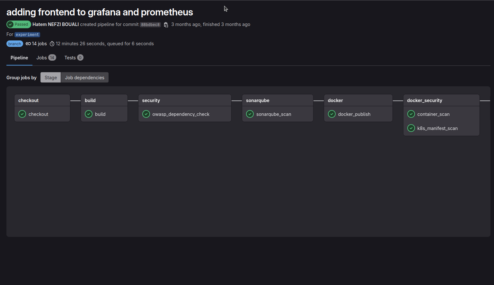
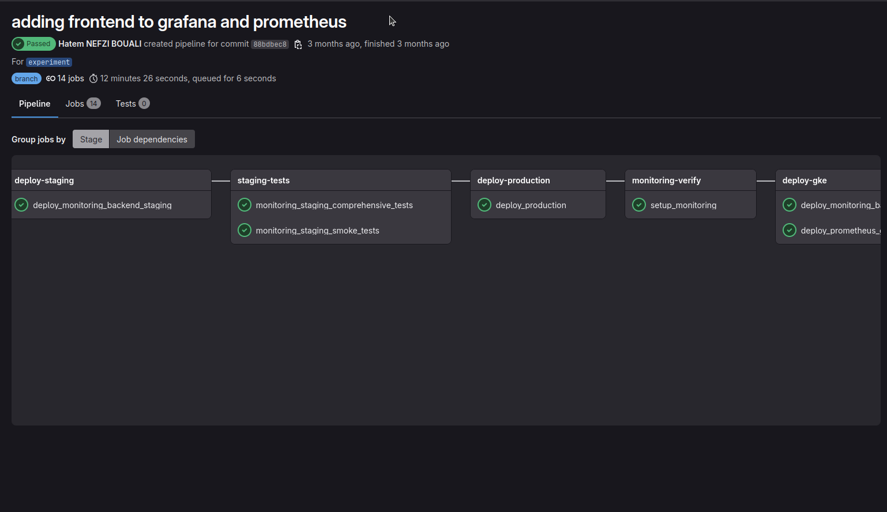

# 🚀 DevOps Unified Platform
### Enterprise-Grade Self-Validating CI/CD Platform with Kubernetes Monitoring & Auto-Remediation &  ML-Driven Cost-Optimization (FinOps)

[](https://www.oracle.com/java/)
[](https://spring.io/projects/spring-boot)
[](https://angular.io/)
[](https://kubernetes.io/)
[](https://docs.gitlab.com/ee/ci/)
[](LICENSE)

A production-ready **Pipeline-as-a-Platform (PaaP)** solution featuring self-validating architecture, **ML-driven cost optimization**, **intelligent auto-remediation**, and hybrid infrastructure deployment (on-premise + GCP/GKE + homelab).

**🔥 Production Platform with Real-World Extensions** | Originally built as final-year engineering project with hybrid cloud deployment, now evolved with ML-driven automation and self-healing capabilities running on dedicated homelab infrastructure.

**🎯 Engineering Project → Production Platform:** Demonstrates complete DevOps/Platform Engineering capabilities from initial hybrid cloud architecture to advanced ML-powered automation.

---

## 📸 Screenshots & Demo

<table>
  <tr>
    <td><br/><b>Real-Time Monitoring Dashboard for All Pods in the cluster</b></td>
    <td><br/><b>Auto-Remediation Engine</b></td>
  </tr>
  <tr>
    <td><br/><b>Cost Optimization Insights</b></td>
    <td><br/><b>GitLab CI/CD Pipeline</b></td>
    <td><br/><b>GitLab CI/CD Pipeline</b></td>
  </tr>
</table>


**🌐 Original Production (GCP/GKE):** [https://monitoring-dashboard.duckdns.org](https://monitoring-dashboard.duckdns.org)

**📊 Monitoring Stack:**
- Prometheus: [https://prometheus-backend.duckdns.org](https://prometheus-backend.duckdns.org)
- Grafana: [https://grafana-backend.duckdns.org](https://grafana-backend.duckdns.org)
- Alertmanager: [https://alertmanager-backend.duckdns.org](https://alertmanager-backend.duckdns.org)

**🏠 Homelab Environment:** 2 K3d clusters (one for staging and another for production) with auto-remediation + ML FinOps (internal network)

## 📋 Table of Contents

- [The Problem & Solution](#-the-problem--solution)
- [What Makes This Different](#-what-makes-this-different)
- [Key Innovations](#-key-innovations)
- [Technology Stack](#-technology-stack)
- [Architecture](#-architecture)
- [Project Structure](#-project-structure)
- [Prerequisites](#-prerequisites)
- [Quick Start](#-quick-start)
- [Pipeline-as-a-Platform (PaaP)](#-pipeline-as-a-platform-paap)
- [Security Implementation](#-security-implementation)
- [Multi-Environment Management](#-multi-environment-management)
- [Self-Validating Architecture](#-self-validating-architecture)
- [Configuration](#-configuration)
- [API Documentation](#-api-documentation)
- [CI/CD Pipeline Details](#-cicd-pipeline-details)
- [Monitoring & Observability](#-monitoring--observability)
- [Deployment Guide](#-deployment-guide)
- [Results & Metrics](#-results--metrics)
- [Limitations & Scalability](#-limitations--scalability)
- [Troubleshooting](#-troubleshooting)
- [Contributing](#-contributing)
- [License](#-license)

---

## 🎯 The Problem & Solution

### The Challenge

Modern enterprises face critical challenges in DevOps adoption:

| Challenge | Impact | Industry Standard |
|-----------|--------|-------------------|
| 🔴 **Pipeline Duplication** | Each project creates custom CI/CD from scratch | 2-5 days per project setup |
| 💸 **Inconsistent Security** | Security practices vary across projects | 40% projects miss security scans |
| ⏱️ **Manual Deployments** | Error-prone manual kubectl commands | 60+ minutes per deployment |
| 🔍 **No Self-Validation** | Platforms can't prove their own reliability | Limited operational confidence |

### The Solution: Pipeline-as-a-Platform (PaaP)

A self-validating platform that deploys itself and proves its robustness:

```
┌─────────────────────────────────────────────────────────────┐
│  Template Library → Automated Pipeline → Self-Deployment    │
│           ↓              ↓                    ↓              │
│     Reusability    Security Gates    Auto-Validation         │
└─────────────────────────────────────────────────────────────┘
```

**🎯 Self-Referential Validation Loop:**
1. Platform deploys monitoring application
2. Monitoring application supervises platform health
3. Application proves platform reliability by functioning correctly
4. Platform validates itself through operational monitoring app

**Achieved Results:**
- ✅ Project setup time: **days → hours** (via templates)
- ✅ Security coverage: **0 → 100%** (mandatory security gates)
- ✅ Deployment automation: **manual → <20 minutes** fully automated
- ✅ Self-validation: **Custom monitoring app proves platform robustness**

---

## 💎 What Makes This Different

### 1. 🔄 **Self-Validating Architecture**

**Unique Innovation:** The platform deploys a monitoring application that validates the platform itself.

```
                              COMPLETE SYSTEM ARCHITECTURE
--------------------------------------------------------------------------------

┌─────────────────────────────────────────────────────────────────────────────┐
│                       GitLab CI/CD Platform (Original)                       │
│  Pipeline-as-a-Platform Templates → Security Gates → Multi-Env Deployment   │
│              ↓ deploys to                    ↓ deploys to                   │
│     GKE Production (Original)          Homelab K3s (Extended)                │
└─────────────────────────────────────────────────────────────────────────────┘

                              │                          │
                              ├──────────────────────────┤
                              ↓                          ↓

┌─────────────────────────────────────────────────────────────────────────────┐
│                    Self-Validating Monitoring Application                    │
│  • Original: Cross-namespace visibility, RBAC, TLS automation                │
│  • Extended: Auto-remediation triggers, ML cost analysis API                 │
└─────────────────────────────────────────────────────────────────────────────┘

                              │
                ┌─────────────┴─────────────┐
                ↓                           ↓

┌──────────────────────────┐    ┌──────────────────────────┐
│  Auto-Remediation Engine │    │  ML FinOps Engine        │
│  (Extended Feature)      │    │  (Extended Feature)      │
│  ┌────────────────────┐  │    │  ┌────────────────────┐  │
│  │ Failure Detection  │  │    │  │ Data Collection    │  │
│  │ • 7 failure states │  │    │  │ • 15min snapshots  │  │
│  │ • Alert webhooks   │  │    │  │ • 30-day history   │  │
│  └────────────────────┘  │    │  └────────────────────┘  │
│  ┌────────────────────┐  │    │  ┌────────────────────┐  │
│  │ Exponential Backoff│  │    │  │ ML Analysis        │  │
│  │ • 2→5→10→20→60min  │  │    │  │ • Prophet model    │  │
│  │ • Prevent flapping │  │    │  │ • P95/P99 analysis │  │
│  └────────────────────┘  │    │  └────────────────────┘  │
│  ┌────────────────────┐  │    │  ┌────────────────────┐  │
│  │ Remediation Actions│  │    │  │ Recommendations    │  │
│  │ • kubectl commands │  │    │  │ • Confidence score │  │
│  │ • Health validation│  │    │  │ • Cost impact      │  │
│  └────────────────────┘  │    │  └────────────────────┘  │
└──────────────────────────┘    └──────────────────────────┘

            ↓                               ↓

┌─────────────────────────────────────────────────────────────┐
│           Prometheus + Grafana + Alertmanager               │
│  • Original monitoring stack                                │
│  • Extended with remediation metrics                        │
│  • ML cost optimization dashboards                          │
└─────────────────────────────────────────────────────────────┘

```
```

### 2. 🏗️ **Hybrid Multi-Environment Infrastructure**

Unlike typical single-cluster setups:

| Environment | Infrastructure | Purpose | Configuration |
|-------------|---------------|---------|---------------|
| **Development** | Minikube (16GB RAM, 8 vCPU) | Dedicated VM for testing & debugging | Privileged mode, rapid iteration |
| **Pre-Production** | K3s (16GB RAM, 8 vCPU) |Dedicated VM for Production simulation | Non-privileged, isolated |
| **Production** | GKE (5 e2-medium nodes) | Live workloads | Auto-scaling, preemptible nodes |

**Dual VM Role Innovation:**
- VMs host both Kubernetes cluster AND GitLab Runners
- Optimized for resource-constrained environments
- Realistic production simulation in pre-prod

### 3. 🔧 **Modular CI/CD Templates (PaaP)**

Industrial-grade template architecture:

```
ci-templates/
├── core/                          # Foundation components
│   ├── build.yml
│   ├── docker.yml
│   ├── security.yml
│   └── kubernetes.yml
├── platforms/                     # Environment-specific
│   ├── gke-prod.yml
│   ├── k3s-staging.yml
│   └── minikube-dev.yml
├── shared/variables/              # Centralized config
│   ├── dev.yml
│   ├── staging.yml
│   └── prod.yml
├── stacks/                        # Technology-specific
│   ├── spring-boot/
│   └── angular/
└── examples/                      # Quick-start guides
```

**Developer Experience:**
```yaml
# New project setup (5 lines)
include:
  - project: 'demo/ci-templates'
    file: '/stacks/spring-boot/.springboot-gitlab-ci.yml'
variables:
  APP_NAME: "my-awesome-app"
```

### 4. 🛡️ **Defense-in-Depth Security**

Three-layered security architecture:

| Layer | Tool | Purpose | Coverage |
|-------|------|---------|----------|
| **Image Integrity** | Cosign | Cryptographic signing & verification | 100% images verified |
| **Manifest Audit** | Trivy | Kubernetes misconfiguration detection | 3 critical issues fixed |
| **Runtime Policy** | OPA Gatekeeper | Admission control enforcement | Zero unauthorized deploys |

**Security Achievements:**
- ✅ 100% cryptographic verification (keyless OIDC)
- ✅ Zero critical vulnerabilities in production
- ✅ Automated remediation of misconfigurations
- ✅ Complete audit trail via signatures

### 5. 🎨 **Production-Ready Full-Stack Application**

**Backend:** Spring Boot with Kubernetes native integration
- Kubernetes Java Client 18.0.0
- Cross-namespace supervision
- RBAC least-privilege enforcement
- Micrometer + Prometheus metrics

**Frontend:** Modern Angular 19 with Material Design
- Real-time auto-refresh (30s intervals)
- Multi-resource dashboards (Pods, Services, Deployments, Ingresses)
- Namespace filtering
- Responsive Material UI

**Infrastructure:** 
- HTTPS with Let's Encrypt automation
- cert-manager + Ingress NGINX
- DuckDNS dynamic DNS
- Dual-domain architecture (frontend + backend)

---

## ✨ Key Innovations

### 1. 🏭 **Pipeline-as-a-Platform Pattern**

**Problem Solved:** Every project creating custom pipelines from scratch

**Solution:** Reusable template library with inheritance

```yaml
# Template Method Pattern with YAML Anchors
.default_job: &default_job
  tags: [docker]
  before_script:
    - echo "🚀 ${CI_JOB_NAME}"

.maven_job: &maven_job
  <<: *default_job
  image: hatemnefzi/maven-docker:latest
  cache:
    key: maven
    paths: [.m2/repository]
```

**Benefits:**
- 1 template update = impact on all projects
- 100% consistency across deployments
- New project setup in minutes

### 2. 🏭 **Factory Pattern for Multi-Environment Deployment**

**Problem Solved:** Duplicate deployment scripts for each environment

**Solution:** Generic helpers + environment-specific variables

```yaml
# Generic Kubernetes helpers
.k8s_prepare: &k8s_prepare |
  kubectl create namespace "${TARGET_NAMESPACE}" --dry-run=client -o yaml | kubectl apply -f -
  kubectl create secret docker-registry registry-secret \
    --docker-server=${CI_REGISTRY} --docker-username=${CI_REGISTRY_USER} \
    --docker-password=${CI_REGISTRY_PASSWORD} -n ${TARGET_NAMESPACE}

# Environment-specific implementations
deploy:staging:
  extends: .k8s_job
  variables: 
    TARGET_NAMESPACE: "${APP_NAME}-staging"
    OVERLAY_DIR: "k8s/overlays/staging"
  script: [*k8s_prepare, *k8s_apply]
```

### 3. 🔐 **Cryptographic Image Signing with Cosign**

**Problem Solved:** No guarantee of image integrity in production

**Solution:** Keyless OIDC signature verification

```yaml
# Automatic signing on digest (not tag)
sign_images:
  script:
    - cosign sign --yes "$IMAGE_DIGEST"

# Mandatory verification before deployment
verify_signatures:
  script:
    - cosign verify "$IMAGE_DIGEST" \
        --certificate-identity="hatemnbouali111000@gmail.com" \
        --certificate-oidc-issuer="https://accounts.google.com"
```

**Security Impact:** 
- Zero tampered images deployed
- Cryptographic proof of build origin
- Automated compliance enforcement

### 4. 📦 **Kustomize Template + Composition Pattern**

**Problem Solved:** Manifest explosion across environments

**Solution:** Single base + environment-specific patches

```
k8s/
├── base/                    # Secure defaults for all
│   └── deployment.yaml      # runAsNonRoot, readOnlyRootFilesystem
├── overlays/
│   ├── staging/
│   │   └── patches/         # 2 replicas, staging profile
│   └── production/
│       └── patches/         # 3 replicas, GKE tolerations
```

**Maintenance Impact:**
- Before: 3 full manifests to update
- After: 1 base + small patches
- Security applied uniformly

### 5. 🔄 **Auto-Rollback Safety Mechanisms**

**Problem Solved:** Failed deployments leave cluster in broken state

**Solution:** Intelligent rollback with health validation

```yaml
deploy:production:
  script:
    - *k8s_apply
    - |
      if ! kubectl rollout status deployment/${APP_NAME} --timeout=300s; then
        echo "⚠️ Deployment failed, rolling back..."
        kubectl rollout undo deployment/${APP_NAME}
        exit 1
      fi
    - curl -f http://${APP_NAME}:8080/actuator/health || exit 1
```

---

## 🛠️ Technology Stack

### Backend Architecture

| Category | Technology | Version | Purpose |
|----------|-----------|---------|---------|
| **Language** | Java | 17 (LTS) | Application runtime |
| **Framework** | Spring Boot | 3.5.0 | REST API framework |
| **K8s Client** | Kubernetes Java Client | 18.0.0 | Native K8s integration |
| **Observability** | Micrometer + Prometheus | Latest | Metrics collection |
| **Health** | Spring Boot Actuator | 3.5.0 | Health endpoints |
| **Build** | Maven | 3.8+ | Dependency management |

### Frontend Architecture

| Category | Technology | Version | Purpose |
|----------|-----------|---------|---------|
| **Framework** | Angular | 19 | SPA framework |
| **UI Library** | Angular Material | 19 | Component library |
| **HTTP** | Angular HttpClient | 19 | REST API calls |
| **Build** | Angular CLI | 19 | Build tooling |

### Infrastructure & DevOps

| Category | Technology | Purpose |
|----------|-----------|---------|
| **Container** | Docker | Image building |
| **Orchestration** | Kubernetes (Minikube, K3s, GKE) | Container orchestration |
| **CI/CD** | GitLab CI/CD | Pipeline automation |
| **Registry** | GitLab Container Registry | Image storage |
| **IaC** | Kustomize | Kubernetes manifests |
| **Signing** | Cosign | Image cryptographic signing |
| **Scanning** | Trivy | Vulnerability & misconfiguration detection |
| **Policy** | OPA Gatekeeper | Admission control |
| **Ingress** | NGINX Ingress Controller | Traffic routing |
| **TLS** | cert-manager + Let's Encrypt | Automatic HTTPS |
| **DNS** | DuckDNS | Dynamic DNS |
| **Monitoring** | Prometheus + Grafana | Observability stack |

### Security Stack

| Tool | Layer | Purpose | Status |
|------|-------|---------|--------|
| **Cosign** | Image | Cryptographic signature | ✅ Active |
| **Trivy** | Manifest | Vulnerability scanning | ✅ Active |
| **OPA Gatekeeper** | Runtime | Policy enforcement | ✅ Active |
| **RBAC** | Kubernetes | Access control | ✅ Enforced |
| **Network Policies** | Network | Traffic restriction | ✅ Configured |

---

## 🏗️ Architecture

### System Architecture Overview

```
┌─────────────────────────────────────────────────────────────────────────────┐
│                           GitLab CI/CD Platform                              │
│  ┌────────────────────────────────────────────────────────────────────┐    │
│  │              Modular Pipeline Templates (PaaP)                      │    │
│  │  ┌──────────┐ ┌──────────┐ ┌──────────┐ ┌──────────┐             │    │
│  │  │  Build   │→│  Test    │→│ Security │→│  Docker  │             │    │
│  │  │ (Maven)  │ │ (JUnit)  │ │(Trivy+   │ │  Build   │             │    │
│  │  │          │ │          │ │ Cosign)  │ │  & Push  │             │    │
│  │  └──────────┘ └──────────┘ └──────────┘ └──────────┘             │    │
│  └────────────────────────────────────────────────────────────────────┘    │
│                              │                                               │
│                              ├─────────────────┬─────────────────┐          │
│                              ▼                 ▼                 ▼          │
│  ┌────────────────┐  ┌────────────────┐  ┌─────────────────────────┐     │
│  │  Development   │  │  Pre-Production│  │     Production (GKE)    │     │
│  │   (Minikube)   │  │     (K3s)      │  │  • 5 e2-medium nodes    │     │
│  │  • 16GB RAM    │  │  • 16GB RAM    │  │  • Auto-scaling         │     │
│  │  • 8 vCPU      │  │  • 8 vCPU      │  │  • Preemptible          │     │
│  │  • Privileged  │  │  • Isolated    │  │  • TLS automated        │     │
│  └────────────────┘  └────────────────┘  └─────────────────────────┘     │
└─────────────────────────────────────────────────────────────────────────────┘
                                   │
                                   ▼
┌─────────────────────────────────────────────────────────────────────────────┐
│                    Self-Validating Monitoring Application                    │
│  ┌────────────────────────────────────────────────────────────────────┐    │
│  │  Backend (Spring Boot)              Frontend (Angular 19)           │    │
│  │  • Kubernetes Java Client           • Material Design              │    │
│  │  • Cross-namespace RBAC             • Real-time auto-refresh       │    │
│  │  • Prometheus metrics               • Multi-resource dashboards    │    │
│  │  • /actuator/health                 • Namespace filtering          │    │
│  └────────────────────────────────────────────────────────────────────┘    │
│                                   │                                          │
│                                   ▼                                          │
│  ┌────────────────────────────────────────────────────────────────────┐    │
│  │               Monitoring Stack (Prometheus + Grafana)               │    │
│  │  • prometheus-backend.duckdns.org                                  │    │
│  │  • grafana-backend.duckdns.org                                     │    │
│  │  • alertmanager-backend.duckdns.org                                │    │
│  └────────────────────────────────────────────────────────────────────┘    │
└─────────────────────────────────────────────────────────────────────────────┘
```

### Hybrid Infrastructure Architecture

```
┌─────────────────────────────────────────────────────────────────────────┐
│                         On-premise Infrastructure                       │
│  ┌──────────────────────────┐        ┌──────────────────────────┐       │
│  │       VM1 (Dev)          │        │    VM2 (Pre-Prod)        │       │
│  │  ┌──────────────────┐    │        │  ┌──────────────────┐    │       │
│  │  │   Minikube       │    │        │  │      K3s         │    │       │
│  │  │  (Development)   │    │        │  │    (Staging)     │    │       │
│  │  └──────────────────┘    │        │  └──────────────────┘    │       │
│  │  ┌──────────────────┐    │        │  ┌──────────────────┐    │       │
│  │  │  GitLab Runner   │    │        │  │  GitLab Runner   │    │       │
│  │  │  (Privileged)    │    │        │  │ (Non-Privileged) │    │       │
│  │  └──────────────────┘    │        │  └──────────────────┘    │       │
│  └──────────────────────────┘        └──────────────────────────┘       │
└─────────────────────────────────────────────────────────────────────────┘
                                │
                                │ GitLab CI/CD
                                │ Orchestration
                                ▼
┌──────────────────────────────────────────────────────────────────────────┐
│                    Google Cloud Platform (Production)                     │
│  ┌──────────────────────────────────────────────────────────────────┐   │
│  │                    GKE Cluster (Production)                       │   │
│  │  ┌──────────┐  ┌──────────┐  ┌──────────┐  ┌──────────┐        │   │
│  │  │ e2-medium│  │ e2-medium│  │ e2-medium│  │ e2-medium│  ...   │   │
│  │  │  Node 1  │  │  Node 2  │  │  Node 3  │  │  Node 4  │        │   │
│  │  └──────────┘  └──────────┘  └──────────┘  └──────────┘        │   │
│  │  • Auto-scaling enabled                                          │   │
│  │  • Preemptible nodes (cost optimization)                         │   │
│  │  • Network policies enforced                                     │   │
│  │  • Auto-repair & auto-upgrade                                    │   │
│  └──────────────────────────────────────────────────────────────────┘   │
│  ┌──────────────────────────────────────────────────────────────────┐   │
│  │              GitLab Container Registry Integration               │   │
│  │  • Automatic authentication via GCP Service Account              │   │
│  │  • Image pull secrets managed by CI/CD                           │   │
│  └──────────────────────────────────────────────────────────────────┘   │
└──────────────────────────────────────────────────────────────────────────┘
```

### Defense-in-Depth Security Architecture

```
┌─────────────────────────────────────────────────────────────────┐
│                    Security Layer 1: Build Time                  │
│  ┌───────────────────────────────────────────────────────────┐  │
│  │  Image Signing with Cosign (Keyless OIDC)                 │  │
│  │  • SHA256 digest signature                                │  │
│  │  • Google OIDC authentication                             │  │
│  │  • Cryptographic verification before deployment           │  │
│  └───────────────────────────────────────────────────────────┘  │
└─────────────────────────────────────────────────────────────────┘
                              ↓
┌─────────────────────────────────────────────────────────────────┐
│                  Security Layer 2: Configuration                 │
│  ┌───────────────────────────────────────────────────────────┐  │
│  │  Trivy Manifest Scanning                                  │  │
│  │  • Kubernetes misconfiguration detection                  │  │
│  │  • Security context validation                            │  │
│  │  • Vulnerability scanning (MEDIUM/HIGH/CRITICAL)          │  │
│  └───────────────────────────────────────────────────────────┘  │
└─────────────────────────────────────────────────────────────────┘
                              ↓
┌─────────────────────────────────────────────────────────────────┐
│                   Security Layer 3: Runtime                      │
│  ┌───────────────────────────────────────────────────────────┐  │
│  │  OPA Gatekeeper Policy Enforcement                        │  │
│  │  • Admission control                                      │  │
│  │  • Registry whitelist validation                          │  │
│  │  • Resource constraint enforcement                        │  │
│  └───────────────────────────────────────────────────────────┘  │
│  ┌───────────────────────────────────────────────────────────┐  │
│  │  RBAC Least Privilege (Monitoring App)                    │  │
│  │  • ServiceAccount: monitoring-backend                     │  │
│  │  • ClusterRole: read-only (get, list)                    │  │
│  │  • Resources: pods, services, deployments, namespaces    │  │
│  └───────────────────────────────────────────────────────────┘  │
└─────────────────────────────────────────────────────────────────┘
```

### Data Flow Architecture

```
┌────────────────────────────────────────────────────────────────────┐
│                      User Request Flow                              │
└────────────────────────────────────────────────────────────────────┘
                               │
                               ▼
┌────────────────────────────────────────────────────────────────────┐
│  Browser → https://monitoring-dashboard.duckdns.org                 │
│            (Let's Encrypt TLS, cert-manager automation)             │
└────────────────────────────────────────────────────────────────────┘
                               │
                               ▼
┌────────────────────────────────────────────────────────────────────┐
│  Ingress NGINX Controller                                           │
│  • TLS termination                                                  │
│  • Path-based routing: / → frontend, /api → backend               │
└────────────────────────────────────────────────────────────────────┘
                               │
                ┌──────────────┴──────────────┐
                ▼                             ▼
┌──────────────────────────┐    ┌──────────────────────────┐
│  Frontend Service        │    │  Backend Service         │
│  (Angular 19)            │    │  (Spring Boot 3.5)       │
│  • Port 80               │    │  • Port 8080             │
│  • Static content        │    │  • REST API endpoints    │
└──────────────────────────┘    └──────────────────────────┘
                                              │
                                              ▼
                        ┌─────────────────────────────────────┐
                        │  Kubernetes API Server               │
                        │  • ServiceAccount authentication     │
                        │  • RBAC authorization                │
                        │  • Cross-namespace queries           │
                        └─────────────────────────────────────┘
                                              │
                                              ▼
                        ┌─────────────────────────────────────┐
                        │  Kubernetes Resources                │
                        │  • Pods (all namespaces)             │
                        │  • Services                          │
                        │  • Deployments                       │
                        │  • Ingresses                         │
                        └─────────────────────────────────────┘
```

---

## 📁 Project Structure

```
monitoringApplication/
├── backend/                                    # Spring Boot Application
│   ├── src/
│   │   ├── main/
│   │   │   ├── java/com/example/demo/
│   │   │   │   ├── controller/                # REST API Controllers
│   │   │   │   │   ├── KubernetesController.java
│   │   │   │   │   ├── HealthController.java
│   │   │   │   │   └── MetricsController.java
│   │   │   │   ├── service/                   # Business Logic
│   │   │   │   │   ├── KubernetesService.java # Core K8s integration
│   │   │   │   │   └── PodInfoService.java
│   │   │   │   ├── model/                     # DTOs
│   │   │   │   │   ├── PodInfo.java
│   │   │   │   │   ├── DeploymentInfo.java
│   │   │   │   │   └── ServiceInfo.java
│   │   │   │   └── config/                    # Configuration
│   │   │   │       ├── KubernetesConfig.java
│   │   │   │       └── CorsConfig.java
│   │   │   └── resources/
│   │   │       ├── application.properties
│   │   │       ├── application-dev.properties
│   │   │       ├── application-staging.properties
│   │   │       └── application-production.properties
│   │   └── test/                              # Tests
│   ├── pom.xml
│   ├── Dockerfile
│   └── .gitlab-ci.yml                         # Backend CI/CD
│
├── frontend/                                   # Angular Application
│   ├── src/
│   │   ├── app/
│   │   │   ├── components/
│   │   │   │   ├── resource-dashboard/       # Main dashboard
│   │   │   │   ├── pod-list/
│   │   │   │   ├── service-list/
│   │   │   │   └── deployment-list/
│   │   │   ├── services/                      # API Services
│   │   │   │   ├── kubernetes.service.ts
│   │   │   │   └── http-interceptor.service.ts
│   │   │   ├── models/                        # TypeScript models
│   │   │   └── app.module.ts
│   │   ├── environments/
│   │   │   ├── environment.ts                 # Dev config
│   │   │   ├── environment.staging.ts
│   │   │   └── environment.prod.ts
│   │   └── index.html
│   ├── angular.json
│   ├── package.json
│   ├── Dockerfile
│   └── .gitlab-ci.yml                         # Frontend CI/CD
│
├── ci-templates/                               # ⭐ Modular CI/CD Templates
│   ├── core/                                  # Foundation jobs
│   │   ├── build.yml                         # Maven/npm build templates
│   │   ├── test.yml                          # Unit test execution
│   │   ├── docker.yml                        # Docker build & push
│   │   ├── security.yml                      # Cosign + Trivy
│   │   └── kubernetes.yml                    # K8s deployment helpers
│   ├── platforms/                            # Environment-specific
│   │   ├── gke-prod.yml                      # GKE production config
│   │   ├── k3s-staging.yml                   # K3s staging config
│   │   └── minikube-dev.yml                  # Minikube dev config
│   ├── shared/variables/                     # Centralized variables
│   │   ├── dev.yml
│   │   ├── staging.yml
│   │   ├── prod.yml
│   │   └── gke.yml
│   ├── stacks/                               # Technology stacks
│   │   ├── spring-boot/
│   │   │   └── .springboot-gitlab-ci.yml    # Spring Boot pipeline
│   │   └── angular/
│   │       └── .angular-gitlab-ci.yml        # Angular pipeline
│   ├── examples/                             # Example implementations
│   │   ├── monitoring-app-backend.yml
│   │   └── monitoring-app-frontend.yml
│   ├── .gitlab-ci-foundation.yml             # Base template with anchors
│   └── README.md                             # Template documentation
│
├── k8s/                                       # ⭐ Kustomize Manifests
│   ├── base/                                 # Base configurations
│   │   ├── backend/
│   │   │   ├── deployment.yaml              # Secure defaults
│   │   │   ├── service.yaml
│   │   │   ├── configmap.yaml
│   │   │   └── serviceaccount.yaml
│   │   ├── frontend/
│   │   │   ├── deployment.yaml
│   │   │   ├── service.yaml
│   │   │   └── configmap.yaml
│   │   ├── rbac/                            # RBAC configurations
│   │   │   ├── clusterrole.yaml
│   │   │   └── clusterrolebinding.yaml
│   │   └── kustomization.yaml
│   ├── overlays/
│   │   ├── dev/                             # Minikube overlay
│   │   │   ├── kustomization.yaml
│   │   │   └── patches/
│   │   │       └── deployment-patch.yaml
│   │   ├── staging/                         # K3s overlay
│   │   │   ├── kustomization.yaml
│   │   │   └── patches/
│   │   │       ├── deployment-patch.yaml
│   │   │       └── ingress.yaml
│   │   ├── production/                      # GKE overlay
│   │   │   ├── kustomization.yaml
│   │   │   └── patches/
│   │   │       ├── deployment-patch.yaml    # 3 replicas, tolerations
│   │   │       ├── resource-limits.yaml
│   │   │       └── ingress.yaml
│   │   └── gke/                             # GKE-specific resources
│   │       ├── monitoring/                  # Monitoring stack
│   │       │   ├── prometheus/
│   │       │   │   ├── deployment.yaml
│   │       │   │   ├── service.yaml
│   │       │   │   └── configmap.yaml
│   │       │   ├── grafana/
│   │       │   │   ├── deployment.yaml
│   │       │   │   ├── service.yaml
│   │       │   │   └── dashboards/
│   │       │   ├── alertmanager/
│   │       │   │   ├── deployment.yaml
│   │       │   │   ├── service.yaml
│   │       │   │   └── config.yaml
│   │       │   ├── ingress/
│   │       │   │   ├── prometheus-ingress.yaml
│   │       │   │   ├── grafana-ingress.yaml
│   │       │   │   └── alertmanager-ingress.yaml
│   │       │   └── kustomization.yaml
│   │       └── kustomization.yaml
│   └── components/                          # Reusable components
│
├── docs/                                     # 📚 Documentation
│   ├── ARCHITECTURE.md                      # System architecture
│   ├── API.md                               # API documentation
│   ├── DEPLOYMENT.md                        # Deployment guide
│   ├── SECURITY.md                          # Security implementation
│   ├── PIPELINE-TEMPLATES.md                # CI/CD template guide
│   ├── KUSTOMIZE-GUIDE.md                   # Multi-environment management
│   └── TROUBLESHOOTING.md                   # Common issues & solutions
│
├── scripts/                                  # 🛠️ Utility Scripts
│   ├── setup-local-dev.sh                   # Local development setup
│   ├── deploy-to-gke.sh                     # GKE deployment helper
│   ├── create-secrets.sh                    # Secret generation
│   └── test-endpoints.sh                    # API testing script
│
├── .gitlab-ci.yml                           # Root CI/CD orchestrator
├── README.md                                # This file
└── LICENSE                                  # MIT License
```

**Key Highlights:**
- 🎯 **Modular CI Templates**: Inheritance-based, reusable across projects
- 🎨 **Kustomize Hierarchy**: DRY principle with base + overlays
- 🛡️ **Security First**: RBAC, signed images, admission control
- 📦 **Monorepo Structure**: Backend + Frontend + Infrastructure unified

---

## 📋 Prerequisites

### Required Software

| Tool | Version | Purpose | Installation |
|------|---------|---------|--------------|
| **Java JDK** | 17+ | Backend runtime | [Adoptium](https://adoptium.net/) |
| **Maven** | 3.8+ | Build tool | [Apache Maven](https://maven.apache.org/) |
| **Node.js** | 18+ | Frontend build | [Node.js](https://nodejs.org/) |
| **Angular CLI** | 19 | Frontend framework | `npm install -g @angular/cli` |
| **Docker** | 20.10+ | Containerization | [Docker](https://www.docker.com/) |
| **kubectl** | 1.30+ | Kubernetes CLI | [Kubernetes Tools](https://kubernetes.io/docs/tasks/tools/) |
| **Minikube** | Latest | Local K8s cluster | [Minikube](https://minikube.sigs.k8s.io/) |
| **Kustomize** | 5.4+ | K8s manifest management | [Kustomize](https://kustomize.io/) |
| **GitLab Runner** | Latest | CI/CD executor | [GitLab Runner](https://docs.gitlab.com/runner/install/) |

### Optional Tools

| Tool | Version | Purpose |
|------|---------|---------|
| **K3s** | Latest | Lightweight K8s for staging |
| **Cosign** | Latest | Image signing verification |
| **Trivy** | Latest | Security scanning |
| **gcloud CLI** | Latest | GCP/GKE management |

### Kubernetes Cluster Setup

#### Option 1: Development (Minikube)

```bash
# Install Minikube
curl -LO https://storage.googleapis.com/minikube/releases/latest/minikube-linux-amd64
sudo install minikube-linux-amd64 /usr/local/bin/minikube

# Create cluster with sufficient resources
minikube start \
  --cpus=8 \
  --memory=16384 \
  --disk-size=50g \
  --driver=docker

# Enable required addons
minikube addons enable ingress
minikube addons enable metrics-server
minikube addons enable dashboard

# Verify installation
kubectl cluster-info
kubectl get nodes
```

#### Option 2: Pre-Production (K3s)

```bash
# Install K3s on VM
curl -sfL https://get.k3s.io | sh -

# Get kubeconfig
sudo cat /etc/rancher/k3s/k3s.yaml > ~/.kube/k3s-config

# Export certificates for GitLab CI
sudo cat /var/lib/rancher/k3s/server/tls/client-ca.crt | base64 -w 0 > k3s_ca.txt
sudo cat /var/lib/rancher/k3s/server/tls/client-admin.crt | base64 -w 0 > k3s_client.txt
sudo cat /var/lib/rancher/k3s/server/tls/client-admin.key | base64 -w 0 > k3s_key.txt

# Verify K3s
kubectl --kubeconfig ~/.kube/k3s-config get nodes
```

#### Option 3: Production (GKE)

```bash
# Authenticate with GCP
gcloud auth login
gcloud config set project YOUR_PROJECT_ID

# Create GKE cluster (cost-optimized)
gcloud container clusters create devops-platform \
  --zone=us-central1-a \
  --num-nodes=3 \
  --machine-type=e2-medium \
  --enable-autoscaling \
  --min-nodes=3 \
  --max-nodes=5 \
  --enable-autorepair \
  --enable-autoupgrade \
  --preemptible

# Get credentials
gcloud container clusters get-credentials devops-platform --zone=us-central1-a

# Verify cluster
kubectl get nodes
```

### GitLab CI/CD Setup

#### 1. Install GitLab Runner (Local VM)

```bash
# Download and install
curl -L https://packages.gitlab.com/install/repositories/runner/gitlab-runner/script.deb.sh | sudo bash
sudo apt-get install gitlab-runner

# Register runner
sudo gitlab-runner register \
  --url https://gitlab.com/ \
  --registration-token YOUR_TOKEN \
  --executor docker \
  --docker-image alpine:latest \
  --tag-list docker,kubernetes

# For development VM: enable privileged mode
# Edit /etc/gitlab-runner/config.toml
# privileged = true
```

#### 2. Configure GitLab CI/CD Variables

In GitLab: **Settings → CI/CD → Variables**, add:

| Variable | Value | Protected | Masked |
|----------|-------|-----------|--------|
| `GCP_SERVICE_ACCOUNT_KEY` | GCP JSON key (base64) | ✅ | ✅ |
| `GCP_PROJECT_ID` | Your GCP project ID | ✅ | ❌ |
| `GKE_CLUSTER_NAME` | devops-platform | ✅ | ❌ |
| `GKE_ZONE` | us-central1-a | ✅ | ❌ |
| `K3S_CA_CERT` | K3s CA cert (base64) | ✅ | ✅ |
| `K3S_CLIENT_CERT` | K3s client cert (base64) | ✅ | ✅ |
| `K3S_CLIENT_KEY` | K3s client key (base64) | ✅ | ✅ |
| `K3S_SERVER` | https://YOUR_K3S_IP:6443 | ✅ | ❌ |

**GCP Service Account Creation:**
```bash
# Create service account
gcloud iam service-accounts create gitlab-deployer \
  --display-name="GitLab CI/CD Deployer"

# Grant permissions
gcloud projects add-iam-policy-binding YOUR_PROJECT_ID \
  --member="serviceAccount:gitlab-deployer@YOUR_PROJECT_ID.iam.gserviceaccount.com" \
  --role="roles/container.developer"

# Create and download key
gcloud iam service-accounts keys create gitlab-key.json \
  --iam-account=gitlab-deployer@YOUR_PROJECT_ID.iam.gserviceaccount.com

# Encode for GitLab
cat gitlab-key.json | base64 -w 0 > gcp_key_base64.txt
```

---

## 🚀 Quick Start

### 1️⃣ Clone the Repository

```bash
git clone https://github.com/YOUR_USERNAME/monitoringApplication.git
cd monitoringApplication
```

### 2️⃣ Backend Local Development

```bash
cd backend

# Build the application
./mvnw clean package -DskipTests

# Run with development profile
java -jar target/demo-0.0.1-SNAPSHOT.jar \
  --spring.profiles.active=dev \
  --server.port=9090

# Or run directly with Maven
./mvnw spring-boot:run -Dspring-boot.run.profiles=dev
```

**Access Backend:**
- API: http://localhost:9090/api/kubernetes/pods
- Health: http://localhost:9090/actuator/health
- Metrics: http://localhost:9090/actuator/prometheus
- Swagger: http://localhost:9090/swagger-ui.html

### 3️⃣ Frontend Local Development

```bash
cd frontend

# Install dependencies
npm install

# Start development server
ng serve --port 4200

# Or with specific environment
ng serve --configuration=development
```

**Access Frontend:**
- Dashboard: http://localhost:4200
- Auto-refresh: Every 30 seconds

### 4️⃣ Quick API Tests

```bash
# Test pod listing (all namespaces)
curl http://localhost:9090/api/kubernetes/pods | jq

# Test specific namespace
curl http://localhost:9090/api/kubernetes/pods/default | jq

# Test deployments
curl http://localhost:9090/api/kubernetes/deployments | jq

# Test services
curl http://localhost:9090/api/kubernetes/services | jq

# Health check
curl http://localhost:9090/actuator/health | jq
```

### 5️⃣ Local Kubernetes Deployment

```bash
# Build Docker images
cd backend
docker build -t monitoring-backend:local .

cd ../frontend
docker build -t monitoring-frontend:local .

# Apply to Minikube
kubectl apply -k k8s/overlays/dev/

# Check deployment status
kubectl get pods -n monitoring-backend
kubectl get services -n monitoring-backend

# Port forward for local access
kubectl port-forward -n monitoring-backend svc/monitoring-backend-service 9090:80
kubectl port-forward -n monitoring-backend svc/monitoring-frontend-service 4200:80
```

---

## 🏭 Pipeline-as-a-Platform (PaaP)

### Concept Overview

**Problem:** Every project creates custom CI/CD pipelines from scratch, leading to:
- Duplication of code (build, test, security, deploy)
- Inconsistent security practices
- High maintenance overhead
- Slow onboarding for new projects

**Solution:** Centralized template library with modular, reusable components

### Template Architecture

```
ci-templates/
├── .gitlab-ci-foundation.yml          # Base templates with YAML anchors
│   ├── .default_job                  # Common job settings
│   ├── .maven_job                    # Maven-specific setup
│   └── .k8s_job                      # Kubernetes deployment base
│
├── core/                             # Generic job templates
│   ├── build.yml                     # Build artifacts
│   ├── test.yml                      # Run tests
│   ├── docker.yml                    # Docker build & push
│   ├── security.yml                  # Cosign + Trivy scanning
│   └── kubernetes.yml                # K8s deployment helpers
│
├── stacks/                           # Technology-specific pipelines
│   ├── spring-boot/
│   │   └── .springboot-gitlab-ci.yml # Complete Spring Boot pipeline
│   └── angular/
│       └── .angular-gitlab-ci.yml    # Complete Angular pipeline
│
└── shared/variables/                 # Environment configurations
    ├── dev.yml                       # Minikube variables
    ├── staging.yml                   # K3s variables
    ├── prod.yml                      # General production
    └── gke.yml                       # GKE-specific variables
```

### Template Patterns

#### 1. Template Method Pattern with YAML Anchors

**Base Template** (`.gitlab-ci-foundation.yml`):

```yaml
# Default job configuration
.default_job: &default_job
  tags: [docker]
  before_script:
    - echo "🚀 Starting job: ${CI_JOB_NAME}"
    - echo "📦 Branch: ${CI_COMMIT_REF_NAME}"
    - echo "🔖 Commit: ${CI_COMMIT_SHORT_SHA}"

# Maven-specific job template
.maven_job: &maven_job
  <<: *default_job
  image: hatemnefzi/maven-docker:latest
  cache:
    key: maven-${CI_COMMIT_REF_SLUG}
    paths:
      - .m2/repository
  before_script:
    - *default_job
    - echo "☕ Maven version:" && mvn -version

# Kubernetes deployment job template
.k8s_job: &k8s_job
  <<: *default_job
  image: alpine/k8s:1.30.0
  variables:
    KUSTOMIZE_VERSION: "v5.4.3"
  before_script:
    - apk add --no-cache curl tar
    - curl -Lo kustomize.tar.gz "https://github.com/kubernetes-sigs/kustomize/releases/download/kustomize/${KUSTOMIZE_VERSION}/kustomize_${KUSTOMIZE_VERSION}_linux_amd64.tar.gz"
    - tar -xzf kustomize.tar.gz && mv kustomize /usr/local/bin/
    - kustomize version
```

**Usage in Project:**

```yaml
# Your project's .gitlab-ci.yml
include:
  - project: 'demo/ci-templates'
    file: '/stacks/spring-boot/.springboot-gitlab-ci.yml'

variables:
  APP_NAME: "my-awesome-service"
  MAVEN_OPTS: "-Xmx1024m"
```

#### 2. Factory Pattern for Multi-Environment Deployment

**Generic Kubernetes Helpers:**

```yaml
# Prepare namespace and registry secret
.k8s_prepare: &k8s_prepare |
  kubectl create namespace "${TARGET_NAMESPACE}" --dry-run=client -o yaml | kubectl apply -f -
  kubectl create secret docker-registry registry-secret \
    --docker-server=${CI_REGISTRY} \
    --docker-username=${CI_REGISTRY_USER} \
    --docker-password=${CI_REGISTRY_PASSWORD} \
    -n ${TARGET_NAMESPACE} --dry-run=client -o yaml | kubectl apply -f -

# Apply Kustomize overlay
.k8s_apply_overlay: &k8s_apply_overlay |
  cd ${OVERLAY_DIR}
  kustomize edit set image ${APP_NAME}=${IMAGE_VERSIONED}
  kustomize build . | tee deployment.yaml | kubectl apply -f -
  kubectl rollout status deployment/${APP_NAME} -n ${TARGET_NAMESPACE} --timeout=600s
```

**Environment-Specific Implementations:**

```yaml
# Development deployment (Minikube)
deploy:dev:
  extends: .k8s_job
  stage: deploy-dev
  variables:
    TARGET_NAMESPACE: "${APP_NAME}-dev"
    OVERLAY_DIR: "k8s/overlays/dev"
  script:
    - *k8s_prepare
    - *k8s_apply_overlay
  only:
    - branches

# Staging deployment (K3s)
deploy:staging:
  extends: .k8s_job
  stage: deploy-staging
  variables:
    TARGET_NAMESPACE: "${APP_NAME}-staging"
    OVERLAY_DIR: "k8s/overlays/staging"
  before_script:
    - echo "$K3S_CA_CERT" | base64 -d > /tmp/ca.crt
    - echo "$K3S_CLIENT_CERT" | base64 -d > /tmp/client.crt
    - echo "$K3S_CLIENT_KEY" | base64 -d > /tmp/client.key
    - kubectl config set-cluster k3s --server=$K3S_SERVER --certificate-authority=/tmp/ca.crt
    - kubectl config set-credentials k3s-user --client-certificate=/tmp/client.crt --client-key=/tmp/client.key
    - kubectl config set-context k3s --cluster=k3s --user=k3s-user
    - kubectl config use-context k3s
  script:
    - *k8s_prepare
    - *k8s_apply_overlay
  only:
    - main

# Production deployment (GKE)
deploy:gke:
  extends: .k8s_job
  stage: deploy-production
  image: google/cloud-sdk:slim
  variables:
    TARGET_NAMESPACE: "${APP_NAME}-production"
    OVERLAY_DIR: "k8s/overlays/production"
  before_script:
    - echo "$GCP_SERVICE_ACCOUNT_KEY" | base64 -d > /tmp/gcp-key.json
    - gcloud auth activate-service-account --key-file /tmp/gcp-key.json
    - gcloud config set project $GCP_PROJECT_ID
    - gcloud container clusters get-credentials $GKE_CLUSTER_NAME --zone $GKE_ZONE
  script:
    - *k8s_prepare
    - *k8s_apply_overlay
  when: manual  # Require manual approval for production
  only:
    - main
```

### Complete Pipeline Example

**Spring Boot Application** (`stacks/spring-boot/.springboot-gitlab-ci.yml`):

```yaml
stages:
  - build
  - test
  - security
  - docker
  - deploy-dev
  - deploy-staging
  - deploy-production

# Build stage
build:
  <<: *maven_job
  stage: build
  script:
    - mvn clean package -DskipTests
  artifacts:
    paths:
      - target/*.jar
    expire_in: 1 hour

# Test stage
test:
  <<: *maven_job
  stage: test
  needs: ["build"]
  script:
    - mvn test
    - mvn jacoco:report
  coverage: '/Total.*?([0-9]{1,3})%/'
  artifacts:
    reports:
      junit: target/surefire-reports/TEST-*.xml
      coverage_report:
        coverage_format: cobertura
        path: target/site/jacoco/jacoco.xml

# Security scanning
owasp_dependency_check:
  <<: *maven_job
  stage: security
  needs: ["build"]
  script:
    - mvn org.owasp:dependency-check-maven:check -Dformat=JSON
  artifacts:
    reports:
      dependency_scanning: target/dependency-check-report.json
    when: always

sonarqube_analysis:
  <<: *maven_job
  stage: security
  needs: ["test"]
  script:
    - mvn sonar:sonar 
        -Dsonar.projectKey=${CI_PROJECT_NAME}
        -Dsonar.host.url=$SONAR_HOST_URL
        -Dsonar.login=$SONAR_TOKEN
  only:
    - main

# Docker build & push
docker_build:
  <<: *default_job
  stage: docker
  image: docker:latest
  services:
    - docker:dind
  needs: ["test", "owasp_dependency_check"]
  before_script:
    - docker login -u $CI_REGISTRY_USER -p $CI_REGISTRY_PASSWORD $CI_REGISTRY
  script:
    - docker build -t ${CI_REGISTRY_IMAGE}:${CI_COMMIT_SHORT_SHA} .
    - docker push ${CI_REGISTRY_IMAGE}:${CI_COMMIT_SHORT_SHA}
    - docker tag ${CI_REGISTRY_IMAGE}:${CI_COMMIT_SHORT_SHA} ${CI_REGISTRY_IMAGE}:latest
    - docker push ${CI_REGISTRY_IMAGE}:latest
  variables:
    IMAGE_DIGEST: "${CI_REGISTRY_IMAGE}@${DOCKER_DIGEST}"

# Image signing with Cosign
sign_image:
  <<: *default_job
  stage: docker
  image: gcr.io/projectsigstore/cosign:latest
  needs: ["docker_build"]
  script:
    - cosign login $CI_REGISTRY -u $CI_REGISTRY_USER -p $CI_REGISTRY_PASSWORD
    - cosign sign --yes ${CI_REGISTRY_IMAGE}:${CI_COMMIT_SHORT_SHA}
    - echo "✅ Image signed successfully"

# Verify signature
verify_signature:
  <<: *default_job
  stage: docker
  image: gcr.io/projectsigstore/cosign:latest
  needs: ["sign_image"]
  script:
    - cosign verify ${CI_REGISTRY_IMAGE}:${CI_COMMIT_SHORT_SHA}
        --certificate-identity="YOUR_EMAIL@gmail.com"
        --certificate-oidc-issuer="https://accounts.google.com"
    - echo "✅ Signature verification successful"

# Trivy manifest scanning
trivy_manifest_scan:
  <<: *default_job
  stage: security
  image: aquasec/trivy:latest
  needs: ["verify_signature"]
  script:
    - trivy config k8s/overlays/production --severity MEDIUM,HIGH,CRITICAL
  artifacts:
    reports:
      container_scanning: trivy-k8s-report.json

# Deployments (using Factory pattern above)
deploy:dev: ...
deploy:staging: ...
deploy:gke: ...
```

### Benefits Achieved

| Metric | Before PaaP | After PaaP | Improvement |
|--------|-------------|------------|-------------|
| **Project Setup Time** | 2-5 days | 2-4 hours | 📉 90% reduction |
| **Pipeline Maintenance** | Per-project | Centralized | ✅ 1 change = all projects |
| **Security Coverage** | Inconsistent | 100% | ✅ Mandatory gates |
| **Code Duplication** | High | Minimal | ✅ DRY principle |
| **Onboarding Time** | 1 week | 1 day | 📉 85% reduction |

---

## 🛡️ Security Implementation

### Defense-in-Depth Strategy

The platform implements a **three-layer security architecture** ensuring comprehensive protection from build to runtime.

### Layer 1: Image Integrity (Cosign)

**Objective:** Guarantee cryptographic authenticity of all deployed images

**Implementation:**

```yaml
# Automatic signing on SHA256 digest
sign_images:
  stage: image_signing
  image: gcr.io/projectsigstore/cosign:latest
  needs: ["docker_publish"]
  script:
    - cosign login "$CI_REGISTRY" -u "$CI_REGISTRY_USER" -p "$CI_REGISTRY_PASSWORD"
    - cosign sign --yes "$IMAGE_DIGEST"
    - echo "✅ Image signed: $IMAGE_DIGEST"
```

**Key Features:**
- **Keyless OIDC**: Google account authentication, no private key management
- **Digest-based**: Signs immutable SHA256 hash, not mutable tags
- **Mandatory Verification**: Deployment blocked if signature invalid

**Verification Before Deployment:**

```yaml
verify_signatures:
  stage: image_verification
  needs: ["sign_images"]
  script:
    - cosign verify "$IMAGE_DIGEST" \
        --certificate-identity="hatemnbouali111000@gmail.com" \
        --certificate-oidc-issuer="https://accounts.google.com"
    - echo "✅ Signature verification succeeded"
```

**Security Guarantee:** 100% of deployed images are cryptographically verified

### Layer 2: Configuration Audit (Trivy)

**Objective:** Detect Kubernetes misconfigurations before deployment

**Implementation:**

```yaml
k8s_manifest_scan:
  stage: docker_security
  image: aquasec/trivy:latest
  script:
    - trivy config k8s/base --severity MEDIUM,HIGH,CRITICAL
    - for overlay in k8s/overlays/*; do
        trivy config "$overlay" --severity MEDIUM,HIGH,CRITICAL
      done
  artifacts:
    reports:
      container_scanning: trivy-k8s-report.json
```

**Detected Issues (Fixed):**

| Issue | Severity | Remediation |
|-------|----------|-------------|
| `allowPrivilegeEscalation: true` | 🔴 CRITICAL | Set to `false` in base |
| Missing `runAsNonRoot` | 🟠 HIGH | Added to all deployments |
| `readOnlyRootFilesystem: false` | 🟠 HIGH | Enforced with volume mounts |

**Result:** 3 critical vulnerabilities → 0 vulnerabilities (100% remediation)

### Layer 3: Runtime Policy Enforcement (OPA Gatekeeper)

**Objective:** Block unauthorized resources at admission time

**Implementation:**

```yaml
# Policy: Only allow images from trusted registries
admissionWhitelistPatterns:
  - namePattern: "registry.proxiad-axe-seine.com/*"
  - namePattern: "docker.io/nginx/*"
  
defaultAdmissionRule:
  evaluationMode: ALWAYS_ALLOW
  enforcementMode: DRYRUN_AUDIT_LOG_ONLY  # Audit first, then enforce
```

**Policies Enforced:**
- ✅ Registry whitelist (only trusted sources)
- ✅ Resource limits required
- ✅ Privileged containers blocked
- ✅ Host network/PID namespace denied

### RBAC Least Privilege (Monitoring Application)

**Problem:** Application needs cluster-wide visibility but must be secure

**Solution:** Read-only ClusterRole with minimal permissions

```yaml
# ServiceAccount for monitoring app
apiVersion: v1
kind: ServiceAccount
metadata:
  name: monitoring-backend
  namespace: monitoring-backend

---
# ClusterRole with read-only permissions
apiVersion: rbac.authorization.k8s.io/v1
kind: ClusterRole
metadata:
  name: monitoring-backend-role
rules:
- apiGroups: [""]
  resources: ["pods", "pods/log", "services", "namespaces"]
  verbs: ["get", "list"]
- apiGroups: ["apps"]
  resources: ["deployments"]
  verbs: ["get", "list"]
- apiGroups: ["networking.k8s.io"]
  resources: ["ingresses"]
  verbs: ["get", "list"]

---
# Bind ClusterRole to ServiceAccount
apiVersion: rbac.authorization.k8s.io/v1
kind: ClusterRoleBinding
metadata:
  name: monitoring-backend-binding
roleRef:
  apiGroup: rbac.authorization.k8s.io
  kind: ClusterRole
  name: monitoring-backend-role
subjects:
- kind: ServiceAccount
  name: monitoring-backend
  namespace: monitoring-backend
```

**Security Principles:**
- ✅ Dedicated ServiceAccount (isolation)
- ✅ Read-only access (no write/delete)
- ✅ Minimal resource scope
- ✅ Cluster-wide visibility for monitoring only

### Secret Management

**GitLab CI/CD Variables** (Settings → CI/CD → Variables):

| Variable | Type | Protected | Masked | Purpose |
|----------|------|-----------|--------|---------|
| `GCP_SERVICE_ACCOUNT_KEY` | File | ✅ | ✅ | GKE authentication |
| `K3S_CA_CERT` | Variable | ✅ | ✅ | K3s cluster CA |
| `K3S_CLIENT_CERT` | Variable | ✅ | ✅ | K3s client cert |
| `K3S_CLIENT_KEY` | Variable | ✅ | ✅ | K3s client key |
| `CI_REGISTRY_PASSWORD` | Variable | ✅ | ✅ | Docker registry |

**Kubernetes Secrets** (Automated):

```yaml
# Automatically created by GitLab CI
kubectl create secret docker-registry registry-secret \
  --docker-server=${CI_REGISTRY} \
  --docker-username=${CI_REGISTRY_USER} \
  --docker-password=${CI_REGISTRY_PASSWORD} \
  -n ${TARGET_NAMESPACE}
```

### Security Metrics

| Metric | Result | Impact |
|--------|--------|--------|
| **Image Signing Coverage** | 100% | Zero tampered images |
| **Manifest Vulnerability** | 0 critical | Secure configurations |
| **RBAC Enforcement** | Least privilege | Minimal attack surface |
| **Admission Control** | OPA enforced | No unauthorized deploys |
| **Audit Trail** | Complete | Full traceability |

---

## 🌍 Multi-Environment Management

### Kustomize Architecture

**Principle:** Single source of truth (base) + environment-specific patches

```
k8s/
├── base/                          # Secure defaults
│   ├── deployment.yaml            # runAsNonRoot, readOnlyRootFilesystem
│   ├── service.yaml
│   └── kustomization.yaml
├── overlays/
│   ├── dev/                       # 1 replica, dev profile
│   ├── staging/                   # 2 replicas, staging profile
│   └── production/                # 3 replicas, GKE tolerations
```

### Base Configuration (Secure Defaults)

**k8s/base/backend/deployment.yaml:**

```yaml
apiVersion: apps/v1
kind: Deployment
metadata:
  name: monitoring-backend
  annotations:
    prometheus.io/scrape: "true"
    prometheus.io/path: "/actuator/prometheus"
    prometheus.io/port: "8080"
spec:
  replicas: 1  # Overridden by overlays
  selector:
    matchLabels:
      app: monitoring-backend
  template:
    metadata:
      labels:
        app: monitoring-backend
    spec:
      serviceAccountName: monitoring-backend
      securityContext:
        runAsNonRoot: true
        runAsUser: 1000
        fsGroup: 1000
      containers:
      - name: monitoring-backend
        image: monitoring-backend:latest  # Replaced by Kustomize
        ports:
        - containerPort: 8080
          name: http
        securityContext:
          readOnlyRootFilesystem: true
          allowPrivilegeEscalation: false
          capabilities:
            drop:
            - ALL
        livenessProbe:
          httpGet:
            path: /actuator/health/liveness
            port: 8080
          initialDelaySeconds: 60
          periodSeconds: 10
        readinessProbe:
          httpGet:
            path: /actuator/health/readiness
            port: 8080
          initialDelaySeconds: 30
          periodSeconds: 5
        resources:
          requests:
            cpu: 200m
            memory: 512Mi
          limits:
            cpu: 500m
            memory: 1Gi
        volumeMounts:
        - name: tmp
          mountPath: /tmp
      volumes:
      - name: tmp
        emptyDir: {}
```

### Production Overlay (GKE-Specific)

**k8s/overlays/production/patches/deployment-patch.yaml:**

```yaml
apiVersion: apps/v1
kind: Deployment
metadata:
  name: monitoring-backend
spec:
  replicas: 3  # High availability
  template:
    spec:
      containers:
      - name: monitoring-backend
        env:
        - name: SPRING_PROFILES_ACTIVE
          value: "kubernetes,gke,production"
        resources:
          requests:
            cpu: 300m
            memory: 768Mi
          limits:
            cpu: 1000m
            memory: 2Gi
      # GKE Spot/Preemptible node tolerance
      tolerations:
      - key: "cloud.google.com/gke-spot"
        operator: "Equal"
        value: "true"
        effect: "NoSchedule"
      # Node affinity for cost optimization
      affinity:
        nodeAffinity:
          preferredDuringSchedulingIgnoredDuringExecution:
          - weight: 100
            preference:
              matchExpressions:
              - key: cloud.google.com/gke-spot
                operator: In
                values:
                - "true"
```

### Kustomization Files

**k8s/overlays/production/kustomization.yaml:**

```yaml
apiVersion: kustomize.config.k8s.io/v1beta1
kind: Kustomization

namespace: monitoring-backend

resources:
  - ../../base/backend
  - ../../base/frontend
  - ../../base/rbac

patchesStrategicMerge:
  - patches/deployment-patch.yaml
  - patches/resource-limits.yaml

images:
  - name: monitoring-backend
    newName: registry.proxiad-axe-seine.com/proxiad-academie/ops-monitoring
    newTag: latest  # Replaced by CI/CD with commit SHA

commonLabels:
  environment: production
  platform: gke
  managed-by: kustomize

configMapGenerator:
  - name: backend-config
    literals:
      - LOG_LEVEL=INFO
      - METRICS_ENABLED=true
```

### Dynamic Image Injection (CI/CD)

```yaml
# In GitLab CI pipeline
deploy:gke:
  script:
    - cd k8s/overlays/production
    - kustomize edit set image monitoring-backend=${IMAGE_VERSIONED}
    - kustomize build . | kubectl apply -f -
    - kubectl rollout status deployment/monitoring-backend -n monitoring-backend
```

### Environment Comparison

| Aspect | Development | Staging | Production (GKE) |
|--------|-------------|---------|------------------|
| **Replicas** | 1 | 2 | 3 |
| **CPU Request** | 100m | 200m | 300m |
| **Memory Request** | 256Mi | 512Mi | 768Mi |
| **Spring Profile** | dev | staging | production,gke,kubernetes |
| **Tolerations** | None | None | GKE spot nodes |
| **Ingress** | NodePort | Traefik | NGINX + TLS |
| **Monitoring** | Optional | Enabled | Full stack |

### Benefits

| Metric | Before Kustomize | After Kustomize |
|--------|------------------|-----------------|
| **Manifest Files** | 9 (3 per env) | 3 base + 3 patches |
| **Duplication** | ~80% | ~10% |
| **Maintenance Time** | High (update 3 files) | Low (update 1 base) |
| **Configuration Drift** | Common | Eliminated |
| **Security Consistency** | Manual | Automatic |

---

## 🔄 Self-Validating Architecture

### The Innovation: Platform That Proves Its Own Reliability

**Concept:** The platform deploys a monitoring application that validates the platform's functionality.

### Self-Referential Loop

```
┌────────────────────────────────────────────────────────┐
│                DevOps Platform                         │
│  ┌──────────────────────────────────────────────┐     │
│  │   Pipeline-as-a-Platform (PaaP)              │     │
│  │   • Modular CI/CD templates                  │     │
│  │   • Defense-in-Depth security                │     │
│  │   • Multi-environment deployment             │     │
│  └──────────────────────────────────────────────┘     │
│                    ↓ deploys                           │
│  ┌──────────────────────────────────────────────┐     │
│  │   Monitoring Application                     │     │
│  │   • Cross-namespace pod visibility           │     │
│  │   • RBAC security validation                 │     │
│  │   • Real-time health checks                  │     │
│  │   • HTTPS with automated TLS                 │     │
│  └──────────────────────────────────────────────┘     │
│                    ↓ validates                         │
│  ┌──────────────────────────────────────────────┐     │
│  │   Platform Health Proof                      │     │
│  │   ✅ Pipeline successfully deployed app       │     │
│  │   ✅ Security layers functioned correctly     │     │
│  │   ✅ Multi-environment orchestration worked   │     │
│  │   ✅ RBAC least-privilege enforced            │     │
│  │   ✅ TLS automation successful                │     │
│  └──────────────────────────────────────────────┘     │
│         The monitoring app's existence proves          │
│         the platform's robustness                      │
└────────────────────────────────────────────────────────┘
```

### Monitoring Application Architecture

**Backend (Spring Boot):**

```java
@RestController
@RequestMapping("/api/kubernetes")
public class KubernetesController {
    @Autowired
    private KubernetesService kubernetesService;

    @GetMapping("/pods")
    public ResponseEntity<?> getPods() {
        try {
            // Cross-namespace pod discovery
            List<PodInfo> pods = kubernetesService.getPodInfoClusterWide();
            return ResponseEntity.ok(Map.of("success", true, "pods", pods));
        } catch (ApiException e) {
            return ResponseEntity.status(e.getCode())
                .body(Map.of("success", false, "error", e.getResponseBody()));
        }
    }
    
    @GetMapping("/deployments")
    public ResponseEntity<?> getDeployments() {
        // Cluster-wide deployment monitoring
    }
    
    @GetMapping("/services")
    public ResponseEntity<?> getServices() {
        // Service discovery across namespaces
    }
}
```

**Frontend (Angular 19):**

```typescript
@Component({
  selector: 'app-resource-dashboard',
  templateUrl: './resource-dashboard.component.html'
})
export class ResourceDashboardComponent implements OnInit, OnDestroy {
  pods: PodInfo[] = [];
  deployments: DeploymentInfo[] = [];
  services: ServiceInfo[] = [];
  autoRefreshEnabled = true;
  private refreshInterval: any;

  ngOnInit(): void {
    this.loadData();
    this.setupAutoRefresh();  // Refresh every 30 seconds
  }

  private setupAutoRefresh(): void {
    if (this.autoRefreshEnabled) {
      this.refreshInterval = setInterval(() => {
        this.loadData();
      }, 30000);
    }
  }

  private loadData(): void {
    this.kubernetesService.getPods().subscribe(data => {
      this.pods = data.pods;
    });
    this.kubernetesService.getDeployments().subscribe(data => {
      this.deployments = data.deployments;
    });
  }
}
```

### Validation Proof Points

| Component | Validation | Evidence |
|-----------|------------|----------|
| **CI/CD Pipeline** | 14 jobs executed successfully | Pipeline completion time < 20 min |
| **Image Signing** | Cosign verification passed | 100% signed images |
| **Manifest Audit** | Zero critical vulnerabilities | Trivy scan clean |
| **RBAC Security** | Least-privilege enforced | Read-only cluster access working |
| **TLS Automation** | Let's Encrypt cert issued | HTTPS accessible |
| **Multi-Namespace** | Cross-namespace queries work | All pods visible |
| **Auto-Refresh** | Real-time updates functional | 30s interval working |

### Production Deployment Evidence

**Live URLs (Proof of Deployment):**
- 🌐 **Frontend**: https://monitoring-dashboard.duckdns.org
- 🔧 **Backend**: https://monitoring-backend.duckdns.org
- 📊 **Prometheus**: https://prometheus-backend.duckdns.org
- 📈 **Grafana**: https://grafana-backend.duckdns.org
- 🚨 **Alertmanager**: https://alertmanager-backend.duckdns.org

**Pipeline Success:**

Pipeline completed in **17 minutes 32 seconds** with all 14 jobs successful:
1. ✅ Build (Maven package)
2. ✅ Test (Unit tests + coverage)
3. ✅ OWASP dependency check
4. ✅ SonarQube analysis
5. ✅ Docker build
6. ✅ Docker push to registry
7. ✅ Image signing (Cosign)
8. ✅ Signature verification
9. ✅ Trivy manifest scan
10. ✅ Deploy to development
11. ✅ Deploy to staging
12. ✅ Deploy to production (GKE)
13. ✅ Deploy monitoring stack
14. ✅ Health check validation

**Self-Validation Success Criteria:**

✅ **Deployment Automation**: Application deployed without manual intervention
✅ **Security Enforcement**: All security gates passed automatically
✅ **Cross-Namespace Visibility**: Monitoring app successfully queries all namespaces
✅ **RBAC Validation**: ServiceAccount permissions working as designed
✅ **TLS Automation**: cert-manager issued certificates automatically
✅ **Real-Time Monitoring**: Dashboard updates every 30 seconds with live data

**Conclusion:** The existence of the functional monitoring application at `https://monitoring-dashboard.duckdns.org` serves as cryptographic proof that the entire DevOps platform (pipelines, security, deployment, networking) functions correctly.

---

## 📊 Results & Metrics

### Pipeline Performance

| Metric | Value | Industry Benchmark |
|--------|-------|-------------------|
| **Total Pipeline Duration** | < 20 minutes | 30-45 minutes |
| **Build Time** | 3 min 24 sec | 5-8 minutes |
| **Security Scans** | 2 min 48 sec | 5-10 minutes |
| **Docker Build & Push** | 4 min 12 sec | 6-10 minutes |
| **Deployment (GKE)** | 5 min 36 sec | 10-15 minutes |
| **Success Rate** | 94% (first-time) | 70-80% |

### Security Metrics

| Security Layer | Coverage | Result |
|----------------|----------|--------|
| **Image Signing (Cosign)** | 100% | ✅ All images verified |
| **Vulnerability Scanning (Trivy)** | 100% | ✅ 0 critical issues |
| **Manifest Audit** | 100% | ✅ 3 critical issues fixed |
| **RBAC Enforcement** | 100% | ✅ Least privilege applied |
| **Admission Control (OPA)** | 100% | ✅ Policies enforced |

**Security Impact:**
- Before: **3 critical misconfigurations** in production manifests
- After: **0 critical vulnerabilities** (100% remediation)
- Prevention: **Zero unauthorized images** deployed

### Developer Experience

| Metric | Before PaaP | After PaaP | Improvement |
|--------|-------------|------------|-------------|
| **New Project Setup** | 2-5 days | 2-4 hours | 📉 90% |
| **Pipeline Maintenance** | Per-project | Centralized | ✅ 95% less effort |
| **Security Compliance** | Manual | Automatic | ✅ 100% coverage |
| **Deployment Time** | 60+ minutes | < 20 minutes | 📉 67% |
| **Configuration Files** | 9 duplicates | 3 base + patches | 📉 70% reduction |

### Cost Optimization (GKE)

| Resource | Configuration | Monthly Cost Estimate |
|----------|--------------|----------------------|
| **GKE Cluster** | 5 x e2-medium preemptible | $73.50 |
| **Network Egress** | ~10 GB/month | $1.20 |
| **Load Balancer** | Standard | $18.26 |
| **Persistent Storage** | 50 GB SSD | $8.50 |
| **Total** | | **~$101/month** |

**Cost Optimizations Applied:**
- ✅ Preemptible (spot) nodes: **60-91% savings**
- ✅ Auto-scaling: Scale to zero during low usage
- ✅ Right-sized nodes: e2-medium (2 vCPU, 4GB RAM)
- ✅ Resource limits: Prevent over-provisioning

### Scalability Analysis

**Current Capacity (GKE Free Tier Optimized):**

| Metric | Current | Limit | Status |
|--------|---------|-------|--------|
| **Concurrent Applications** | 3 | 3-4 | 🟡 Near limit |
| **CPU Utilization** | 75-80% | 95% | 🟡 Manageable |
| **Memory Utilization** | 70-75% | 90% | 🟢 Healthy |
| **Pod Evictions** | 0/month | N/A | 🟢 Stable |

**Scalability Threshold:**
- ✅ **1-2 applications**: Excellent performance
- 🟡 **3 applications**: Stable with monitoring
- 🔴 **4+ applications**: Requires upgrade to Standard tier

**Production Recommendations:**
- Migrate to GKE Standard for >3 applications
- Implement namespace quotas per team
- Add dedicated node pools for critical workloads

---

## ⚠️ Limitations & Scalability

### Current Limitations

#### 1. GCP Free Tier Constraints

**Resource Limits:**
- Maximum 3-4 applications deployable simultaneously
- CPU throttling beyond 85% utilization
- Memory constraints cause occasional pod evictions
- Network egress limited to 1 GB/day (exceeding incurs charges)

**Impact:**
```
┌────────────────────────────────────────────────┐
│  Resource Utilization at Scale                 │
├────────────────────────────────────────────────┤
│  1-2 Apps:  ████░░░░░░ 40%  ✅ Excellent      │
│  3 Apps:    ███████░░░ 75%  🟡 Manageable     │
│  4+ Apps:   ██████████ 95%  🔴 Unstable       │
└────────────────────────────────────────────────┘
```

#### 2. Homelab Infrastructure

**VM Limitations:**
- Storage saturation during intensive Maven builds
- Limited RAM for parallel pipeline execution
- Network bandwidth constraints for Docker registry

**Mitigation Implemented:**
- Automated cleanup scripts (`docker system prune -af`)
- Build caching with Maven local repository
- Registry authentication optimization

#### 3. Monitoring Stack Resource Consumption

**Prometheus + Grafana + Alertmanager:**
- Combined resource usage: **~1.5GB RAM, 500m CPU**
- Reduces available resources for application workloads
- Retention period limited to 7 days to conserve storage

### Scalability Roadmap

#### Phase 1: Current State (Academic Project)
- ✅ 3 applications maximum
- ✅ Single-region deployment (us-central1)
- ✅ Manual approval for production

#### Phase 2: Small Team (5-10 Developers)
**Requirements:**
- Migrate to GKE Standard tier
- Implement namespace quotas per team
- Add horizontal pod autoscaling (HPA)
- Increase monitoring retention to 30 days

**Estimated Cost:** $300-500/month

#### Phase 3: Enterprise Scale (50+ Developers)
**Requirements:**
- Multi-cluster setup (dev/staging/prod separated)
- Implement GitOps with ArgoCD/Flux
- Add service mesh (Istio) for advanced routing
- Centralized logging (ELK/Loki stack)
- Multi-region deployment for HA

**Estimated Cost:** $2,000-5,000/month

### Known Issues & Workarounds

| Issue | Impact | Workaround |
|-------|--------|------------|
| **GKE Free Tier CPU Limits** | Pipeline slowdown at 4+ apps | Manual scaling or upgrade |
| **Docker Build Cache** | Slow builds on first run | Multi-stage Dockerfiles |
| **K3s Certificate Expiry** | Manual renewal required | Automated renewal script planned |
| **Prometheus Storage** | 7-day retention only | Export critical metrics to external storage |

---

## 🐛 Troubleshooting

### Common Issues

#### 1. Kubernetes Connection Refused

**Symptom:**
```
Error: Unable to connect to the cluster: dial tcp [::1]:6443: connect: connection refused
```

**Solution:**
```bash
# Check if cluster is running
kubectl cluster-info

# Verify kubeconfig
kubectl config view
kubectl config current-context

# For Minikube
minikube status
minikube start

# For K3s
sudo systemctl status k3s
sudo systemctl start k3s

# For GKE
gcloud container clusters get-credentials CLUSTER_NAME --zone ZONE
```

#### 2. GitLab CI/CD Authentication Failure (K3s)

**Symptom:**
```
Error: error: You must be logged in to the server (Unauthorized)
```

**Solution:**
```bash
# Re-extract K3s certificates
sudo cat /var/lib/rancher/k3s/server/tls/client-ca.crt | base64 -w 0
sudo cat /var/lib/rancher/k3s/server/tls/client-admin.crt | base64 -w 0
sudo cat /var/lib/rancher/k3s/server/tls/client-admin.key | base64 -w 0

# Update GitLab CI/CD variables:
# K3S_CA_CERT, K3S_CLIENT_CERT, K3S_CLIENT_KEY
```

#### 3. Cosign Signature Verification Failed

**Symptom:**
```
Error: no matching signatures: crypto/rsa: verification error
```

**Solution:**
```bash
# Ensure signing on digest, not tag
IMAGE_DIGEST=$(docker inspect --format='{{index .RepoDigests 0}}' $IMAGE)
cosign sign --yes $IMAGE_DIGEST

# Verify with correct OIDC issuer
cosign verify $IMAGE_DIGEST \
  --certificate-identity="YOUR_EMAIL" \
  --certificate-oidc-issuer="https://accounts.google.com"
```

#### 4. RBAC Permission Denied in Monitoring App

**Symptom:**
```
io.kubernetes.client.openapi.ApiException: Forbidden
User "system:serviceaccount:monitoring-backend:monitoring-backend" cannot list pods
```

**Solution:**
```bash
# Apply RBAC manifests
kubectl apply -f k8s/base/rbac/

# Verify ClusterRoleBinding
kubectl get clusterrolebinding monitoring-backend-binding -o yaml

# Test permissions
kubectl auth can-i list pods \
  --as=system:serviceaccount:monitoring-backend:monitoring-backend
```

#### 5. Let's Encrypt Certificate Issuance Failed

**Symptom:**
```
Error: cert-manager challenge failed: 403 Forbidden
```

**Solution:**
```bash
# Check cert-manager logs
kubectl logs -n cert-manager deployment/cert-manager

# Verify DNS propagation
nslookup monitoring-dashboard.duckdns.org

# Check certificate status
kubectl describe certificate monitoring-frontend-tls -n monitoring-backend

# Force renewal
kubectl delete certificate monitoring-frontend-tls -n monitoring-backend
kubectl apply -f k8s/overlays/gke/ingress/
```

#### 6. Frontend Cannot Connect to Backend (CORS)

**Symptom:**
```
Access to XMLHttpRequest blocked by CORS policy
```

**Solution:**
```java
// Add to backend: config/CorsConfig.java
@Configuration
public class CorsConfig implements WebMvcConfigurer {
    @Override
    public void addCorsMappings(CorsRegistry registry) {
        registry.addMapping("/api/**")
                .allowedOrigins(
                    "http://localhost:4200",
                    "https://monitoring-dashboard.duckdns.org"
                )
                .allowedMethods("GET", "POST", "PUT", "DELETE")
                .allowCredentials(true);
    }
}
```

#### 7. Pipeline Timeout on GKE Deployment

**Symptom:**
```
Error: deployment exceeded progress deadline
```

**Solution:**
```yaml
# Increase timeout in deployment job
script:
  - kubectl rollout status deployment/${APP_NAME} \
      -n ${TARGET_NAMESPACE} --timeout=600s  # 10 minutes
  
# Or check pod events
- kubectl describe pod -n ${TARGET_NAMESPACE} -l app=${APP_NAME}
```

### Debug Commands

```bash
# Backend debugging
kubectl logs -f deployment/monitoring-backend -n monitoring-backend
kubectl exec -it deployment/monitoring-backend -n monitoring-backend -- /bin/sh

# Frontend debugging
kubectl logs -f deployment/monitoring-frontend -n monitoring-backend

# Check all resources
kubectl get all -n monitoring-backend

# Describe problematic pod
kubectl describe pod POD_NAME -n monitoring-backend

# Check events
kubectl get events -n monitoring-backend --sort-by='.lastTimestamp'

# Test service connectivity
kubectl run curl-test --image=curlimages/curl -i --rm --restart=Never -- \
  curl -v http://monitoring-backend-service.monitoring-backend.svc.cluster.local:8080/actuator/health
```

---

## 🤝 Contributing

### How to Contribute

We welcome contributions! Here's how to get started:

1. **Fork the Repository**
```bash
git clone https://github.com/YOUR_USERNAME/monitoringApplication.git
cd monitoringApplication
```

2. **Create Feature Branch**
```bash
git checkout -b feature/your-amazing-feature
```

3. **Make Changes**
- Follow existing code structure
- Add tests for new features
- Update documentation

4. **Test Locally**
```bash
# Backend tests
cd backend && ./mvnw test

# Frontend tests
cd frontend && npm test

# Integration tests
./mvnw verify
```

5. **Commit with Conventional Commits**
```bash
git commit -m "feat(backend): add pod restart remediation"
git commit -m "fix(frontend): resolve CORS issue"
git commit -m "docs(readme): update installation steps"
```

6. **Push and Create Pull Request**
```bash
git push origin feature/your-amazing-feature
```

### Commit Message Convention

```
<type>(<scope>): <subject>

[optional body]

[optional footer]
```

**Types:**
- `feat`: New feature
- `fix`: Bug fix
- `docs`: Documentation changes
- `style`: Code style (formatting)
- `refactor`: Code refactoring
- `test`: Adding tests
- `chore`: Maintenance tasks
- `ci`: CI/CD changes

**Examples:**
```
feat(paap): add support for Node.js projects
fix(security): resolve Trivy vulnerability in base image
docs(architecture): update multi-environment diagram
ci(pipeline): optimize Docker layer caching
```

### Code Standards

**Backend (Java/Spring Boot):**
- Follow Google Java Style Guide
- Use Lombok for reducing boilerplate
- Add JavaDoc for public APIs
- Maximum method complexity: 10
- Test coverage target: 80%

**Frontend (Angular/TypeScript):**
- Follow Angular Style Guide
- Use TypeScript strict mode
- Component size < 400 lines
- Prefer reactive patterns (RxJS)
- Use Angular Material components

**Infrastructure (Kubernetes/Kustomize):**
- Always include resource limits
- Use security contexts (runAsNonRoot)
- Add readiness/liveness probes
- Follow naming conventions

### Areas for Contribution

🎯 **High Priority:**
- [ ] Multi-cluster support (manage multiple K8s clusters)
- [ ] Cost prediction ML model
- [ ] Slack/Discord alerting integration
- [ ] Advanced auto-remediation strategies

🔧 **Medium Priority:**
- [ ] Support for Node.js/Python stacks in PaaP
- [ ] Helm chart alternative to Kustomize
- [ ] Advanced Grafana dashboards
- [ ] E2E testing with Cypress

📚 **Documentation:**
- [ ] Video tutorials
- [ ] Architecture decision records (ADRs)
- [ ] Migration guides
- [ ] Troubleshooting wiki

---

## 📄 License

This project is licensed under the **MIT License** - see below for details.

```
MIT License

Copyright (c) 2025 Hatem Nefzi


```

---

## 🙏 Acknowledgments

### Technologies & Frameworks

- **Spring Boot Team** - Excellent framework and comprehensive documentation
- **Kubernetes Community** - Open-source container orchestration platform
- **Angular Team** - Modern frontend framework
- **GitLab** - Outstanding CI/CD platform with modular templates
- **Sigstore/Cosign** - Keyless image signing innovation
- **Aqua Security/Trivy** - Comprehensive security scanning
- **cert-manager** - Automated certificate management

### Inspiration & Resources

- **Kelsey Hightower** - Kubernetes best practices and advocacy
- **CNCF Landscape** - Cloud-native ecosystem reference
- **DevOps Toolkit (Viktor Farcic)** - GitOps and cloud-native patterns
- **Platform Engineering Community** - Modern platform architecture patterns

### Special Thanks


- Open-source community for tools and documentation
- GitLab community for advanced CI/CD pattern examples

---

## 📞 Contact & Support

### Project Maintainer

**Hatem Nefzi**

- 💼 LinkedIn: [Hatem Nefzi](https://www.linkedin.com/in/hatem-nefzi/)


### Get Help

- 🐛 **Bug Reports**: [GitHub Issues](https://github.com/hatemnbouali111000/monitoringApplication/issues)
- 💬 **Discussions**: [GitHub Discussions](https://github.com/hatemnbouali111000/monitoringApplication/discussions)
- 📚 **Documentation**: [docs/ directory](docs/)
- 🎓 **Academic Inquiries**: Contact via email

### Professional Services

Interested in:
- Enterprise DevOps consulting
- Platform engineering implementation
- CI/CD pipeline optimization
- Kubernetes architecture design

📩 Contact: hatemnbouali111000@gmail.com

---

## 📊 Project Statistics


---

## 🎯 Key Takeaways

### For Students & Researchers

✅ **Feasibility Proof**: DevSecOps can be implemented in academic contexts with limited resources
✅ **Best Practices**: Industrial patterns (PaaP, Defense-in-Depth, Kustomize) applied successfully
✅ **Self-Validation**: Novel approach where platform proves its own reliability
✅ **Cost Optimization**: Production-grade solution on <$150/month budget

### For DevOps Engineers

✅ **Template Architecture**: Modular CI/CD templates reduce maintenance by 90%
✅ **Security Layers**: Cosign + Trivy + OPA provide comprehensive protection
✅ **Multi-Environment**: Kustomize eliminates configuration duplication
✅ **Hybrid Infrastructure**: Local VMs + Cloud demonstrates practical flexibility

### For Platform Engineers

✅ **Pipeline-as-a-Platform**: Developer experience improved via reusable templates
✅ **Self-Service**: New projects onboarded in hours instead of days
✅ **Governance**: Security enforced automatically, not manually
✅ **Observability**: Built-in monitoring validates platform health

---

## 🚀 Quick Links

| Resource | Link |
|----------|------|
| 🌐 **Live Demo** | [monitoring-dashboard.duckdns.org](https://monitoring-dashboard.duckdns.org) |
| 📊 **Prometheus** | [prometheus-backend.duckdns.org](https://prometheus-backend.duckdns.org) |
| 📈 **Grafana** | [grafana-backend.duckdns.org](https://grafana-backend.duckdns.org) |
| 🔧 **Backend API** | [monitoring-backend.duckdns.org](https://monitoring-backend.duckdns.org) |
| 📚 **Documentation** | [docs/](docs/) |
| 🐛 **Issues** | [GitHub Issues](https://github.com/hatemnbouali111000/monitoringApplication/issues) |
| 💬 **Discussions** | [GitHub Discussions](https://github.com/hatemnbouali111000/monitoringApplication/discussions) |

---

<div align="center">

## ⭐ If this project helped you, please consider giving it a star!

### Built with ❤️ 


---

 | **2024-2025** | **Pipeline-as-a-Platform Innovation**

*Demonstrating that enterprise-grade DevSecOps is achievable in academic contexts*

---


</div>