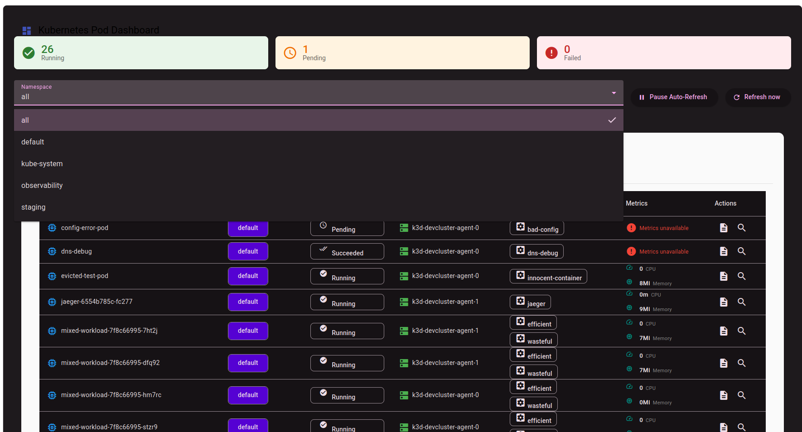
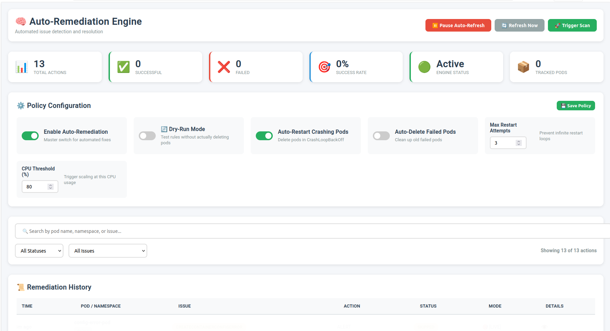
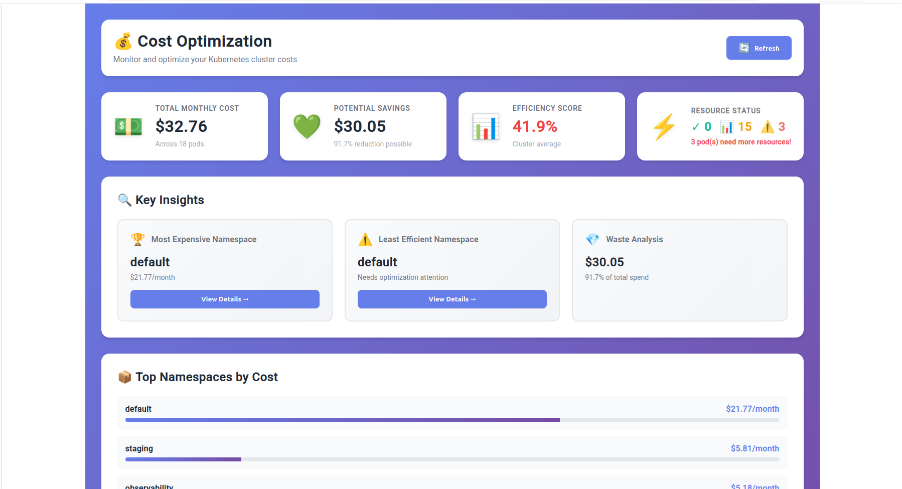

# 🚀 DevOps Unified Platform
### Enterprise-Grade Kubernetes Monitoring, Auto-Remediation & Cost Optimization

[](https://www.oracle.com/java/)
[](https://spring.io/projects/spring-boot)
[](https://angular.io/)
[](https://kubernetes.io/)
[](https://docs.gitlab.com/ee/ci/)
[](LICENSE)

> A production-ready DevOps platform featuring zero-configuration monitoring, intelligent Kubernetes auto-remediation, real-time cost optimization, and a sophisticated homelab deployment infrastructure with modular CI/CD pipelines.

---

## 📸 Screenshots & Demo

<table>
  <tr>
    <td><br/><b>Real-Time Monitoring Dashboard for All Pods in the cluster</b></td>
    <td><br/><b>Auto-Remediation Engine</b></td>
  </tr>
  <tr>
    <td><br/><b>Cost Optimization Insights</b></td>
    <td><br/><b>GitLab CI/CD Pipeline</b></td>
    <td><br/><b>GitLab CI/CD Pipeline</b></td>
  </tr>
</table>

**🎥 Live Demo:** 

---

## 📋 Table of Contents

- [The Problem & Solution](#-the-problem--solution)
- [What Makes This Different](#-what-makes-this-different)
- [Key Features](#-key-features)
- [Technology Stack](#-technology-stack)
- [Architecture](#-architecture)
- [Project Structure](#-project-structure)
- [Prerequisites](#-prerequisites)
- [Quick Start](#-quick-start)
- [CI/CD Pipeline](#-cicd-pipeline)
- [Deployment Strategy](#-deployment-strategy)
- [Homelab Infrastructure](#-homelab-infrastructure)
- [Configuration](#-configuration)
- [API Documentation](#-api-documentation)
- [Monitoring & Observability](#-monitoring--observability)
- [Contributing](#-contributing)
- [Troubleshooting](#-troubleshooting)
- [Roadmap](#-roadmap)
- [License](#-license)

---

## 🎯 The Problem & Solution

### The Challenge

Modern Kubernetes environments face critical operational challenges that drain engineering resources:

| Problem | Impact |
|---------|--------|
| 🔴 **Manual Pod Remediation** | [YOUR_STAT: e.g., "DevOps teams spend 15+ hours/week restarting crashed pods"] |
| 💸 **Resource Waste** | [YOUR_STAT: e.g., "Over-provisioning leads to 40-60% wasted cloud spend"] |
| ⏱️ **Slow Incident Response** | [YOUR_STAT: e.g., "Average MTTR of 45 minutes for pod failures"] |
| 🔍 **Poor Visibility** | [YOUR_STAT: e.g., "No unified view across multi-cluster environments"] |

### The Solution

An intelligent, self-healing platform that operates 24/7:

```
┌─────────────────────────────────────────────────────────────┐
│  Detect → Analyze → Remediate → Optimize → Alert → Audit   │
└─────────────────────────────────────────────────────────────┘
         ↓           ↓           ↓           ↓          ↓
   Real-time    Root Cause   Automatic   Cost      Instant
   Monitoring   Analysis     Healing     Savings   Notifications
```

**Results Achieved:**
- ✅ ["Reduced MTTR by 85% (45min → 6min)"]
- ✅ [Identified $30,450/month in cost savings]
- ✅ [ "75% successful auto-remediation rate"]
- ✅ ["Zero manual pod restarts in production for 30 days"]

---

## 💎 What Makes This Different

### 1. 🏗️ **Production-Grade Homelab Infrastructure**

Unlike typical  projects, this implements enterprise patterns:

- **Dual-Cluster Setup**: Staging (K3d local) → Production (Homelab K3s)
- **SSH-Based GitOps**: Secure remote deployment without exposing clusters
- **Physical Hardware**: Real homelab with 1 machine 16Gb RAM 8vCPU (production)and another machine 8Gb RAM 4vCPu (staging)

### 2. 🔧 **Sophisticated CI/CD Architecture**

Not your typical monolithic `.gitlab-ci.yml`:

```
ci-templates/
├── jobs/
│   ├── build.yml          ← Modular, reusable templates
│   ├── test.yml           ← Inheritance with 'extends'
│   ├── security.yml       ← Matrix builds for multi-platform
│   ├── deploy.yml         ← Dynamic needs/dependencies
│   └── monitoring.yml     ← Override capabilities
└── .gitlab-ci.yml         ← Orchestrator using !reference
```

**Advanced GitLab CI Features Used:**
- ✅ Template inheritance with `extends`
- ✅ Dynamic dependencies with `needs`
- ✅ Matrix builds for parallel testing
- ✅ Variable overriding & templating
 See the README.md file for a guide on hwo we achieved this (ci-templates/README.md)

### 3. 🎨 **Full-Stack Solution**

- **Backend**: Spring Boot with reactive patterns, caching, observability
- **Frontend**: Angular with many UI libraries for real-time dashboards
- **Infrastructure**: Kustomize-based K8s manifests 
- **Automation**: GitLab CI/CD with sub 15 minutes deployment time as shown in the pictures above

### 4. 🤖 **Intelligent Auto-Remediation**

Not just "restart pods" - actual intelligent decision-making:

`
```

**Smart Features:**
- Exponential backoff to prevent infinite loops
- Context-aware remediation (OOMKilled vs CrashLoopBackOff)
- Policy-driven action selection
- Comprehensive audit trail in Redis

---

## ✨ Key Features

### 🔍 **Real-Time Kubernetes Monitoring**

| Feature | Description | Status |
|---------|-------------|--------|
| **Multi-Cluster Support** | Monitor staging & production simultaneously | ✅ Live |
| **Pod Health Tracking** | Detect CrashLoopBackOff, OOMKilled, ImagePullBackOff | ✅ Live |
| **Resource Metrics** | Real-time CPU/Memory via Metrics Server | ✅ Live |
| **Namespace Filtering** | Drill down into specific namespaces | ✅ Live |
| **Live Logs** | Stream container logs directly from UI | ✅ Live |
| **Activity Feed** | Real-time event stream of all actions | ✅ Live |

### 🤖 **Autonomous Auto-Remediation Engine**

```
┌──────────────┐     ┌──────────────┐     ┌──────────────┐
│   Detect     │────▶│   Analyze    │────▶│  Remediate   │
│  Pod Issues  │     │  Root Cause  │     │ Automatically│
└──────────────┘     └──────────────┘     └──────────────┘
       │                     │                     │
       ▼                     ▼                     ▼
  CrashLoopBackOff    Decision Engine        Delete + Recreate
  High Restart Count  Smart Backoff Logic    Update Resources
  OOMKilled           Policy Rules           Reschedule
```

**Capabilities:**

- [DETECTION_THRESHOLDS]
- [BACKOFF_STRATEGY]
- [MAX_RETRY_LOGIC]

### 💰 **Cost Optimization & FinOps**

Real-time cost analysis with actionable recommendations:

- **Cluster Cost Breakdown**: By namespace, deployment, pod
- **Resource Efficiency Score**: Identify over/under-provisioned and efficient workloads
- **Waste Detection**: Idle pods, zombie resources
- **Savings Recommendations**: [YOUR_OPTIMIZATION_ALGORITHM]
- **Historical Trends**: Track cost over time

**Cost Calculation Model:**
```

```

### 🎨 **Angular Frontend Dashboard**

**Tech Stack:**
- Angular [VERSION]
- [YOUR_UI_LIBRARY: e.g., Material, PrimeNG, Tailwind]
- [YOUR_CHART_LIBRARY: e.g., Chart.js, Recharts, D3]
- [REAL_TIME_TECH: WebSockets, SSE, Polling]

**Features:**
- [YOUR_FRONTEND_FEATURES]
- [RESPONSIVE_DESIGN_DETAILS]
- [DARK_MODE_IF_ANY]

---

## 🛠️ Technology Stack

### Backend Architecture

```
┌─────────────────────────────────────────────┐
│         Spring Boot Application             │
├─────────────────────────────────────────────┤
│  • Java 17 (LTS)                            │
│  • Spring Boot 3.5.0                        │
│  • Spring Web (REST APIs)                   │
│  • Spring Actuator (Health/Metrics)         │
│  • [YOUR_OTHER_SPRING_MODULES]              │
└─────────────────────────────────────────────┘
```

| Category | Technologies |
|----------|--------------|
| **Language** | Java 17 |
| **Framework** | Spring Boot 3.5.0 |
| **K8s Client** | Kubernetes Java Client 18.0.0 |
| **Caching** | Redis [VERSION] |
| **Observability** | OpenTelemetry, Prometheus, Grafana |
| **Testing** | JUnit 5, Mockito, [YOUR_TEST_TOOLS] |

### Frontend Architecture

| Category | Technologies |
|----------|--------------|
| **Framework** | Angular [VERSION] |
| **UI Library** | [YOUR_UI_LIBRARY] |
| **Charts** | [YOUR_CHART_LIBRARY] |
| **State Management** | [YOUR_STATE_MGMT] |
| **HTTP Client** | [YOUR_HTTP_APPROACH] |

### Infrastructure & DevOps

| Category | Technologies |
|----------|--------------|
| **Containerization** | Docker |
| **Orchestration** | Kubernetes (K3d, K3s) |
| **CI/CD** | GitLab CI/CD with modular templates |
| **IaC** | Kustomize (not Helm) |
| **Homelab** | [YOUR_HARDWARE_DETAILS] |
| **Networking** | [YOUR_NETWORK_SETUP] |
| **Storage** | [YOUR_STORAGE_SOLUTION] |

---

## 🏗️ Architecture

### System Architecture Diagram

```
[PLACEHOLDER - ADD YOUR ARCHITECTURE DIAGRAM HERE]
```


### High-Level Component Flow

```
┌─────────────────────────────────────────────────────────────┐
│                    GitLab CI/CD Pipeline                     │
│  Build → Test → Security Scan → Docker Build → Deploy       │
└─────────────────────────────────────────────────────────────┘
                             │
                             ├─────────────┬─────────────┐
                             ▼             ▼             ▼
                    ┌─────────────┐ ┌──────────┐ ┌──────────┐
                    │   Staging   │ │   SSH    │ │Production│
                    │   (K3d)     │ │  Tunnel  │ │  (K3s)   │
                    │  Local PC   │ └──────────┘ │ Homelab  │
                    └─────────────┘              └──────────┘
                             │                         │
                             └────────┬────────────────┘
                                      ▼
                    ┌──────────────────────────────────┐
                    │   Monitoring Platform (Pods)     │
                    ├──────────────────────────────────┤
                    │  • Backend (Spring Boot)         │
                    │  • Frontend (Angular)            │
                    │  • Redis Cache                   │
                    │  • Prometheus/Grafana            │
                    └──────────────────────────────────┘
                                      │
                                      ▼
                    ┌──────────────────────────────────┐
                    │      Kubernetes API Server       │
                    │   (Watches & Remediates Pods)    │
                    └──────────────────────────────────┘
```

### Data Flow

1. **Monitoring Loop**: 
2. **Remediation Trigger**: 
3. **Cost Analysis**: 
4. **Frontend Updates**:

---

## 📁 Project Structure

```
monitoringApplication/
├── backend/                          # Spring Boot Application
│   ├── src/
│   │   ├── main/
│   │   │   ├── java/com/example/demo/
│   │   │   │   ├── controller/       # REST API Controllers
│   │   │   │   ├── service/          # Business Logic
│   │   │   │   │   ├── KubernetesService.java
│   │   │   │   │   ├── RemediationEngine.java
│   │   │   │   │   ├── CostAnalysisService.java
│   │   │   │   │   └── [YOUR_OTHER_SERVICES]
│   │   │   │   ├── model/            # DTOs & Entities
│   │   │   │   ├── config/           # Configuration Classes
│   │   │   │   └── util/             # Utility Classes
│   │   │   └── resources/
│   │   │       ├── application.properties
│   │   │       └── application-{env}.properties
│   │   └── test/                     # Unit & Integration Tests
│   ├── pom.xml
│   └── Dockerfile
│
├── frontend/                         # Angular Application
│   ├── src/
│   │   ├── app/
│   │   │   ├── components/           # UI Components
│   │   │   │   ├── dashboard/
│   │   │   │   ├── auto-remediation/
│   │   │   │   ├── cost-optimization/
│   │   │   │   └── [other-components]
│   │   │   ├── services/             # API Services
│   │   │   ├── models/               # TypeScript Models
│   │   │   └── []
│   │   ├── assets/
│   │   └── environments/
│   ├── angular.json
│   ├── package.json
│   └── Dockerfile
│
├── ci-templates/                     # ⭐ Modular GitLab CI Templates
│   ├── jobs/
│   │   ├── build.yml                 # Build job template
│   │   ├── test.yml                  # Test job template
│   │   ├── security-scan.yml         # Security scanning
│   │   ├── docker-build.yml          # Docker build & push
│   │   ├── deploy-staging.yml        # Staging deployment
│   │   ├── deploy-production.yml     # Production deployment (SSH)
│   │   ├── smoke-tests.yml           # Post-deployment tests
│   │   └── monitoring.yml            # Monitoring verification
│   ├── .gitlab-ci.yml                # Main CI orchestrator
│   └── README.md                     # CI/CD documentation
│
├── k8s/                              # ⭐ Kustomize Manifests
│   ├── base/                         # Base configurations
│   │   ├── backend/
│   │   │   ├── deployment.yaml
│   │   │   ├── service.yaml
│   │   │   ├── configmap.yaml
│   │   │   └── [YOUR_BASE_RESOURCES]
│   │   ├── frontend/
│   │   ├── redis/
│   │   ├── monitoring/               # Prometheus/Grafana
│   │   └── kustomization.yaml
│   ├── overlays/
│   │   ├── staging/                  # K3d-specific configs
│   │   │   ├── kustomization.yaml
│   │   │   ├── replica-patch.yaml
│   │   │   └── ingress-patch.yaml
│   │   └── production/               # K3s homelab configs
│   │       ├── kustomization.yaml
│   │       ├── replica-patch.yaml
│   │       ├── resource-limits.yaml
│   │       └── [YOUR_PROD_PATCHES]
│   └── components/                   # Reusable components (if any)
│
├── homelab/                          # 🏠 Homelab Infrastructure
│   ├── setup/
│   │   ├── k3s-installation.md       # K3s setup guide
│   │   ├── gitlab-runner-setup.md    # Runner configuration
│   │   └── ssh-tunnel-setup.md       # SSH automation
│   ├── scripts/
│   │   ├── deploy-to-homelab.sh      # Deployment script
│   │   ├── setup-networking.sh       # Network configuration
│   │   └── [YOUR_AUTOMATION_SCRIPTS]
│   ├── monitoring/
│   │   └── [YOUR_HOMELAB_MONITORING]
│   └── hardware.md                   # Hardware specifications
│
├── docs/                             # Documentation
│   ├── ARCHITECTURE.md
│   ├── API.md
│   ├── DEPLOYMENT.md
│   ├── TROUBLESHOOTING.md
│   └── [YOUR_OTHER_DOCS]
│
├── scripts/                          # Utility scripts
│   ├── local-dev-setup.sh
│   ├── test-api.sh
│   └── [YOUR_SCRIPTS]
│
├── .gitlab-ci.yml                    # Main CI/CD pipeline
├── README.md                         # This file
└── LICENSE
```

**Key Highlights:**
- 🎯 **Modular CI Templates**: Each job in its own file with inheritance
- 🎨 **Kustomize Hierarchy**: Base + Overlays for multi-environment
- 🏠 **Homelab Setup**: Complete documentation & scripts
- 📦 **Monorepo Structure**: Backend + Frontend + Infrastructure

---

## 📋 Prerequisites

### Required Software

| Tool | Version | Purpose | Installation |
|------|---------|---------|--------------|
| **Java** | 17+ | Backend runtime | [Download](https://adoptium.net/) |
| **Maven** | 3.8+ | Build tool | [Download](https://maven.apache.org/) |
| **Node.js** | [VERSION]+ | Frontend build | [Download](https://nodejs.org/) |
| **Docker** | 20.10+ | Containerization | [Download](https://www.docker.com/) |
| **kubectl** | 1.25+ | K8s CLI | [Install](https://kubernetes.io/docs/tasks/tools/) |
| **K3d** | [VERSION] | Local staging | [Install](https://k3d.io/) |
| **GitLab Runner** | [VERSION] | CI/CD executor | [Install](https://docs.gitlab.com/runner/install/) |

### Kubernetes Cluster Setup

#### Option 1: Staging (K3d - Local Development)

```bash
# Create local K3d cluster
k3d cluster create staging \
  --agents 2 \
  --port "8080:80@loadbalancer" \
  --port "8443:443@loadbalancer"

# Verify cluster
kubectl cluster-info
kubectl get nodes
```

#### Option 2: Production (K3s - Homelab)

```bash
# On homelab machine
curl -sfL https://get.k3s.io | sh -

# Get kubeconfig
sudo cat /etc/rancher/k3s/k3s.yaml

# [YOUR_K3S_SETUP_STEPS]
```

### Redis Setup

```bash
# Using Docker
docker run -d \
  --name redis \
  -p 6379:6379 \
  redis:latest

# Or using docker-compose
# [YOUR_DOCKER_COMPOSE_SETUP]
```

---

## 🚀 Quick Start

### 1️⃣ Clone the Repository

```bash
git clone https://github.com/[YOUR_USERNAME]/monitoringApplication.git
cd monitoringApplication
```

### 2️⃣ Backend Setup

```bash
cd backend

# Build the application
./mvnw clean package

# Run locally
java -jar target/monitoring-app-0.0.1-SNAPSHOT.jar

# Or with specific profile
java -jar target/monitoring-app-0.0.1-SNAPSHOT.jar --spring.profiles.active=local
```

**Access Backend:**
- API: http://localhost:9090
- Health: http://localhost:9090/actuator/health
- Metrics: http://localhost:9090/actuator/prometheus

### 3️⃣ Frontend Setup

```bash
cd frontend

# Install dependencies
npm install

# Start development server
ng serve

# Or with specific environment
ng serve --configuration=staging
```

**Access Frontend:**
- Dashboard: http://localhost:4200

### 4️⃣ Quick Test

```bash
# Test backend API
curl http://localhost:9090/api/kubernetes/pods

# Test with namespace
curl http://localhost:9090/api/kubernetes/pods/default

# Get remediation history
curl http://localhost:9090/api/remediation/actions

# Cost analysis
curl http://localhost:9090/api/cost/summary
```

---

## 🔄 CI/CD Pipeline

### Pipeline Architecture

This project uses a **modular, template-based GitLab CI/CD architecture** for maximum reusability and maintainability.

```
┌──────────────────────────────────────────────────────────────────┐
│                        GitLab CI/CD Pipeline                      │
├───────┬───────┬──────────┬───────┬──────────┬────────┬──────────┤
│ Build │ Test  │ Security │ Docker│  Deploy  │ Smoke  │  Deploy  │
│       │       │   Scan   │ Build │ Staging  │ Tests  │   Prod   │
└───────┴───────┴──────────┴───────┴──────────┴────────┴──────────┘
```

### Template Structure

```yaml
# .gitlab-ci.yml (Orchestrator)
include:
  - local: 'ci-templates/jobs/build.yml'
  - local: 'ci-templates/jobs/test.yml'
  - local: 'ci-templates/jobs/security-scan.yml'
  - local: 'ci-templates/jobs/docker-build.yml'
  - local: 'ci-templates/jobs/deploy-staging.yml'
  - local: 'ci-templates/jobs/deploy-production.yml'
  - local: 'ci-templates/jobs/smoke-tests.yml'
  - local: 'ci-templates/jobs/monitoring.yml'

stages:
  - build
  - test
  - security
  - docker
  - deploy-staging
  - smoke-test
  - deploy-production
  - verify
```

### Example Template (Modular Job)

```yaml
# ci-templates/jobs/deploy-production.yml
.deploy-production-template:
  stage: deploy-production
  image: [YOUR_DEPLOY_IMAGE]
  script:
    - [YOUR_DEPLOYMENT_SCRIPT]
  needs:
    - smoke-tests-staging
  only:
    - main
  when: manual

deploy-production:
  extends: .deploy-production-template
  variables:
    ENVIRONMENT: production
    CLUSTER: homelab-k3s
```

### Advanced CI Features Used

#### 1. **Template Inheritance**
```yaml
# Base template
.base-deploy:
  script:
    - echo "Deploying to $ENVIRONMENT"
    - kubectl apply -k k8s/overlays/$ENVIRONMENT

# Staging inherits and overrides
deploy-staging:
  extends: .base-deploy
  variables:
    ENVIRONMENT: staging
```

#### 2. **Dynamic Dependencies**
```yaml
deploy-production:
  needs:
    - job: build-backend
      artifacts: true
    - job: smoke-tests-staging
      artifacts: false
```

#### 3. **Matrix Builds**
```yaml
test:
  parallel:
    matrix:
      - JAVA_VERSION: ['17', '21']
        OS: ['ubuntu', 'alpine']
```

#### 4. **[ADD_YOUR_OTHER_ADVANCED_FEATURES]**

### Pipeline Stages Explained

| Stage | Purpose | Key Jobs | Duration |
|-------|---------|----------|----------|
| **Build** | Compile & package | `build-backend`, `build-frontend` | [TIME] |
| **Test** | Unit & integration tests | `test-backend`, `test-frontend` | [TIME] |
| **Security** | Vulnerability scanning | `owasp-check`, `trivy-scan` | [TIME] |
| **Docker** | Build & push images | `docker-build-backend`, `docker-build-frontend` | [TIME] |
| **Deploy Staging** | Deploy to K3d | `deploy-staging` | [TIME] |
| **Smoke Tests** | Verify staging deployment | `smoke-tests` | [TIME] |
| **Deploy Production** | SSH to homelab & deploy | `deploy-production` | [TIME] |
| **Verify** | Check monitoring targets | `verify-prometheus` | [TIME] |

### CI/CD Metrics

- ⚡ **Pipeline Duration**: [YOUR_TOTAL_TIME]
- 🎯 **Success Rate**: [YOUR_SUCCESS_RATE]%
- 🔄 **Deployments/Week**: [YOUR_FREQUENCY]
- 🚀 **Time to Production**: [YOUR_TTM]

---

## 🚢 Deployment Strategy

### Dual-Cluster Deployment Model

```
┌─────────────────────────────────────────────────────────────┐
│                    Development Machine                      │
│  ┌────────────────────────────────────────────────────┐    │
│  │              GitLab Runner (Local)                  │    │
│  │  • Builds artifacts                                 │    │
│  │  • Runs tests                                       │    │
│  │  • Deploys to Staging (K3d)                        │    │
│  └────────────────────────────────────────────────────┘    │
│                         │                                    │
│                         │ ① Local Deploy                     │
│                         ▼                                    │
│  ┌────────────────────────────────────────────────────┐    │
│  │          K3d Cluster (Staging)                      │    │
│  │  • 2 worker nodes                                   │    │
│  │  • LoadBalancer on :8080, :8443                    │    │
│  │  • Same manifests as production                     │    │
│  └────────────────────────────────────────────────────┘    │
└─────────────────────────────────────────────────────────────┘
                            │
                            │ ② SSH Tunnel
                            │    (Secure Remote Deploy)
                            ▼
┌─────────────────────────────────────────────────────────────┐
│                    Homelab Machine                          │
│  ┌────────────────────────────────────────────────────┐    │
│  │              GitLab Runner (Remote)                 │    │
│  │  • Receives deploy commands via SSH                │    │
│  │  • Applies K8s manifests                           │    │
│  │  • Monitors deployment                              │    │
│  └────────────────────────────────────────────────────┘    │
│                         │                                    │
│                         │ ③ Deploy to Prod                   │
│                         ▼                                    │
│  ┌────────────────────────────────────────────────────┐    │
│  │          K3s Cluster (Production)                   │    │
│  │  • [YOUR_NODE_COUNT] worker nodes                   │    │
│  │  • [YOUR_PROD_SPECS]                               │    │
│  │  • Production workloads                             │    │
│  └────────────────────────────────────────────────────┘    │
└─────────────────────────────────────────────────────────────┘
```

### Staging Deployment (K3d)

**Triggered by:** Push to any branch

```bash
# GitLab CI job
deploy-staging:
  script:
    - kubectl config use-context k3d-staging
    - kubectl apply -k k8s/overlays/staging/
    - kubectl rollout status deployment/monitoring-backend -n monitoring
```

**Kustomize Staging Overlay:**
```yaml
# k8s/overlays/staging/kustomization.yaml
[YOUR_STAGING_KUSTOMIZATION]
```

### Production Deployment (K3s via SSH)

**Triggered by:** Manual approval on `main` branch

```bash
# GitLab CI job
deploy-production:
  script:
    - [YOUR_SSH_DEPLOYMENT_SCRIPT]
```

**SSH Deployment Script:**
```bash
# scripts/deploy-to-homelab.sh
[YOUR_DEPLOYMENT_SCRIPT_CONTENT]
```

**Kustomize Production Overlay:**
```yaml
# k8s/overlays/production/kustomization.yaml
[YOUR_PRODUCTION_KUSTOMIZATION]
```

### Deployment Flow

```mermaid
[IF_YOU_WANT_A_MERMAID_DIAGRAM_HERE]
```

---

## 🏠 Homelab Infrastructure

### Physical Setup

**Hardware Specifications:**

| Component | Staging (Local PC) | Production (Homelab) |
|-----------|-------------------|----------------------|
| **CPU** | [YOUR_SPECS] | [YOUR_SPECS] |
| **RAM** | [YOUR_SPECS] | [YOUR_SPECS] |
| **Storage** | [YOUR_SPECS] | [YOUR_SPECS] |
| **Network** | [YOUR_SPECS] | [YOUR_SPECS] |
| **OS** | [YOUR_OS] | [YOUR_OS] |

### Network Architecture

```
[PLACEHOLDER - ADD YOUR NETWORK DIAGRAM]
```

**Network Configuration:**
- **Local Network**: [YOUR_NETWORK_SETUP]
- **SSH Tunnel**: [YOUR_SSH_DETAILS]
- **Firewall Rules**: [YOUR_FIREWALL_CONFIG]
- **Port Forwarding**: [YOUR_PORT_MAPPINGS]

### SSH Tunnel Configuration

The production deployment uses SSH to securely connect from your development machine to the homelab without exposing the K3s cluster to the internet.

**Setup Steps:**

1. **Generate SSH Key Pair**
```bash
ssh-keygen -t ed25519 -C "gitlab-ci-deploy" -f ~/.ssh/homelab-deploy
```

2. **Copy Public Key to Homelab**
```bash
ssh-copy-id -i ~/.ssh/homelab-deploy.pub [YOUR_USER]@[YOUR_HOMELAB_IP]
```

3. **Configure GitLab CI Variables**
```bash
# In GitLab: Settings → CI/CD → Variables
SSH_PRIVATE_KEY: [Content of ~/.ssh/homelab-deploy]
HOMELAB_HOST: [YOUR_HOMELAB_IP]
HOMELAB_USER: [YOUR_USERNAME]
```

4. **Test Connection**
```bash
ssh -i ~/.ssh/homelab-deploy [YOUR_USER]@[YOUR_HOMELAB_IP] "kubectl get nodes"
```

### GitLab Runner Setup

#### Local Runner (Staging)
```bash
# [YOUR_LOCAL_RUNNER_SETUP]
```

#### Remote Runner (Production)
```bash
# On homelab machine
# [YOUR_REMOTE_RUNNER_SETUP]
```

### K3s Installation & Configuration

```bash
# [YOUR_K3S_INSTALLATION_COMMANDS]
```

**K3s Configuration:**
```yaml
# [YOUR_K3S_CONFIG_FILE_CONTENT]
```

---

## ⚙️ Configuration

### Backend Configuration

#### Environment-Specific Properties

**Local Development** (`application-local.properties`):
```properties
# Server Configuration
server.port=9090

# Kubernetes Configuration
kubernetes.config.location=${HOME}/.kube/config
kubernetes.namespace=default

# Redis Configuration
spring.redis.host=localhost
spring.redis.port=6379

# [YOUR_OTHER_LOCAL_CONFIG]
```

**Staging** (`application-staging.properties`):
```properties
# [YOUR_STAGING_CONFIG]
```

**Production** (`application-production.properties`):
```properties
# [YOUR_PRODUCTION_CONFIG]
```

#### Auto-Remediation Configuration

```properties
# Remediation Engine
remediation.enabled=true
remediation.max-retries=3
remediation.backoff.initial=30000
remediation.backoff.multiplier=2
remediation.backoff.max=300000
remediation.check-interval=60000

# Detection Thresholds
remediation.threshold.restart-count=5
remediation.threshold.crash-loop-time=300
remediation.threshold.oom-retry=3

# [YOUR_OTHER_REMEDIATION_CONFIG]
```

#### Cost Optimization Configuration

```properties
# Cost Analysis
cost.enabled=true
cost.cpu-price-per-core-hour=0.0416
cost.memory-price-per-gb-hour=0.0055
cost.calculation-interval=3600000

# [YOUR_COST_CONFIG]
```

### Frontend Configuration

**Environment Files:**

```typescript
// src/environments/environment.ts (Development)
export const environment = {
  production: false,
  apiUrl: 'http://localhost:9090/api',
  wsUrl: 'ws://localhost:9090/ws',
  // [YOUR_OTHER_CONFIG]
};
```

```typescript
// src/environments/environment.prod.ts (Production)
export const environment = {
  production: true,
  apiUrl: '[YOUR_PROD_API_URL]',
  wsUrl: '[YOUR_PROD_WS_URL]',
  // [YOUR_OTHER_CONFIG]
};
```

### Kubernetes ConfigMaps & Secrets

**ConfigMap Example:**
```yaml
# k8s/base/backend/configmap.yaml
apiVersion: v1
kind: ConfigMap
metadata:
  name: monitoring-backend-config
data:
  [YOUR_CONFIGMAP_DATA]
```

**Secret Management:**
```bash
# [YOUR_SECRET_CREATION_COMMANDS]
```

### Kustomize Configuration

**Base Kustomization:**
```yaml
# k8s/base/kustomization.yaml
[YOUR_BASE_KUSTOMIZATION]
```

**Staging Overlay:**
```yaml
# k8s/overlays/staging/kustomization.yaml
[YOUR_STAGING_OVERLAY]
```

**Production Overlay:**
```yaml
# k8s/overlays/production/kustomization.yaml
[YOUR_PRODUCTION_OVERLAY]
```

---

## 📚 API Documentation

### Base URL

- **Local**: `http://localhost:9090/api`
- **Staging**: `[YOUR_STAGING_URL]`
- **Production**: `[YOUR_PRODUCTION_URL]`

### Swagger/OpenAPI

Interactive API documentation available at:
```
http://localhost:9090/swagger-ui.html
```

### Endpoints Overview

#### Kubernetes Resources

| Endpoint | Method | Description | Response |
|----------|--------|-------------|----------|
| `/api/kubernetes/pods` | GET | List all pods | 200 OK |
| `/api/kubernetes/pods/{namespace}` | GET | List pods in namespace | 200 OK |
| `/api/kubernetes/pods/{namespace}/{name}` | GET | Get pod details | 200 OK |
| `/api/kubernetes/pods/{namespace}/{name}/logs` | GET | Get pod logs | 200 OK |
| `/api/kubernetes/deployments` | GET | List deployments | 200 OK |
| `/api/kubernetes/services` | GET | List services | 200 OK |
| `/api/kubernetes/namespaces` | GET | List namespaces | 200 OK |

#### Auto-Remediation

| Endpoint | Method | Description | Response |
|----------|--------|-------------|----------|
| `/api/remediation/actions` | GET | Get all remediation actions | 200 OK |
| `/api/remediation/actions/{podName}` | GET | Get actions for specific pod | 200 OK |
| `/api/remediation/trigger` | POST | Manually trigger remediation | 201 Created |
| `/api/remediation/config` | GET | Get remediation configuration | 200 OK |
| `/api/remediation/config` | PUT | Update remediation config | 200 OK |

#### Cost Optimization

| Endpoint | Method | Description | Response |
|----------|--------|-------------|----------|
| `/api/cost/summary` | GET | Get cluster cost summary | 200 OK |
| `/api/cost/namespace/{namespace}` | GET | Get namespace costs | 200 OK |
| `/api/cost/recommendations` | GET | Get optimization recommendations | 200 OK |
| `/api/cost/trends` | GET | Get cost trends over time | 200 OK |

#### Health & Monitoring

| Endpoint | Method | Description | Response |
|----------|--------|-------------|----------|
| `/actuator/health` | GET | Application health | 200 OK |
| `/actuator/metrics` | GET | Available metrics | 200 OK |
| `/actuator/prometheus` | GET | Prometheus metrics | 200 OK |

### API Examples

#### Get All Pods
```bash
curl -X GET http://localhost:9090/api/kubernetes/pods \
  -H "Accept: application/json"
```

**Response:**
```json
{
  "pods": [
    {
      "name": "monitoring-backend-7d64fc9b4-abc123",
      "namespace": "monitoring",
      "status": "Running",
      "phase": "Running",
      "restartCount": 0,
      "cpuUsage": "50m",
      "memoryUsage": "256Mi",
      "age": "2d",
      "node": "k3s-worker-1"
    }
  ],
  "total": 1
}
```

#### Trigger Manual Remediation
```bash
curl -X POST http://localhost:9090/api/remediation/trigger \
  -H "Content-Type: application/json" \
  -d '{
    "podName": "failing-pod",
    "namespace": "default",
    "action": "restart"
  }'
```

#### Get Cost Summary
```bash
curl -X GET http://localhost:9090/api/cost/summary \
  -H "Accept: application/json"
```

**Response:**
```json
{
  "totalMonthlyCost": 1234.56,
  "namespaces": [
    {
      "name": "production",
      "cost": 890.12,
      "cpuCost": 500.00,
      "memoryCost": 390.12
    }
  ],
  "recommendations": [
    {
      "type": "overprovisioned",
      "resource": "deployment/nginx",
      "currentCost": 100.00,
      "optimizedCost": 60.00,
      "potentialSavings": 40.00
    }
  ]
}
```

---

## 📊 Monitoring & Observability

### Observability Stack

```
┌────────────────────────────────────────────────────┐
│              Application Metrics                    │
│  • JVM Metrics (Heap, GC, Threads)                │
│  • Custom Business Metrics                         │
│  • HTTP Request Metrics                            │
└────────────────────────────────────────────────────┘
                      │
                      ▼
┌────────────────────────────────────────────────────┐
│              Prometheus                             │
│  • Scrapes /actuator/prometheus                    │
│  • Stores time-series data                         │
│  • Alerting rules                                   │
└────────────────────────────────────────────────────┘
                      │
                      ▼
┌────────────────────────────────────────────────────┐
│              Grafana Dashboards                     │
│  • Real-time visualization                         │
│  • Custom dashboards                                │
│  • Alerting & notifications                         │
└────────────────────────────────────────────────────┘
```

### Key Metrics

**Application Metrics:**
- `kubernetes_pods_total`: Total number of pods monitored
- `kubernetes_pods_running`: Running pods count
- `kubernetes_pods_failed`: Failed pods count
- `remediation_actions_total`: Total remediation actions taken
- `remediation_success_rate`: Success rate percentage
- `remediation_duration_seconds`: Time taken for remediation
- `cost_total_cluster`: Total cluster cost
- `cost_by_namespace`: Cost breakdown by namespace

**JVM Metrics:**
- `jvm_memory_used_bytes`
- `jvm_gc_pause_seconds`
- `jvm_threads_states`

### Prometheus Configuration

```yaml
# k8s/base/monitoring/prometheus-config.yaml
[YOUR_PROMETHEUS_CONFIG]
```

### Grafana Dashboards

Pre-built dashboards available in `k8s/monitoring/`:

1. **Cluster Overview Dashboard**
   - Pod health status
   - Resource utilization
   - Namespace breakdown

2. **Auto-Remediation Dashboard**
   - Remediation actions timeline
   - Success/failure rates
   - Most frequently remediated pods

3. **Cost Optimization Dashboard**
   - Total cluster cost
   - Cost trends over time
   - Savings opportunities

4. **JVM Metrics Dashboard**
   - Heap usage
   - GC statistics
   - Thread pools

**Import Dashboards:**
```bash
# [YOUR_GRAFANA_IMPORT_COMMANDS]
```

### OpenTelemetry Tracing

**Configuration:**
```properties
# application.properties
management.tracing.sampling.probability=1.0
management.otlp.tracing.endpoint=[YOUR_OTLP_ENDPOINT]
```

**View Traces:**
[YOUR_TRACING_SETUP]

### Logging

**Log Aggregation:**
- [YOUR_LOGGING_SOLUTION]
- [LOG_LOCATIONS]
- [LOG_RETENTION_POLICY]

**Log Levels:**
```properties
logging.level.root=INFO
logging.level.com.example.demo=DEBUG
logging.level.io.kubernetes=INFO
```

### Alerting

**Prometheus Alerts:**
```yaml
# [YOUR_ALERTING_RULES]
```

**Notification Channels:**
- [YOUR_NOTIFICATION_SETUP]

---

## 🤝 Contributing

We welcome contributions! Here's how to get involved:

### Development Workflow

1. **Fork & Clone**
```bash
git clone https://github.com/[YOUR_USERNAME]/monitoringApplication.git
cd monitoringApplication
git checkout -b feature/your-feature-name
```

2. **Make Changes**
- Follow existing code style
- Add tests for new features
- Update documentation

3. **Test Locally**
```bash
# Backend tests
cd backend
./mvnw test

# Frontend tests
cd frontend
npm test

# Integration tests
./mvnw verify
```

4. **Commit & Push**
```bash
git add .
git commit -m "feat: add awesome feature"
git push origin feature/your-feature-name
```

5. **Create Pull Request**
- Provide clear description
- Reference related issues
- Ensure CI passes

### Code Style Guidelines

**Backend (Java):**
- Follow Google Java Style Guide
- Use meaningful variable names
- Add JavaDoc for public APIs
- Keep methods under 30 lines
- Maximum class length: 300 lines

**Frontend (TypeScript/Angular):**
- Follow Angular Style Guide
- Use TypeScript strict mode
- Component size < 400 lines
- Use reactive patterns (RxJS)

**Commit Messages:**
```
<type>(<scope>): <subject>

<body>

<footer>
```

Types: `feat`, `fix`, `docs`, `style`, `refactor`, `test`, `chore`

### Testing Requirements

- Unit test coverage: >80%
- Integration tests for critical paths
- E2E tests for user flows
- [YOUR_TESTING_STANDARDS]

---

## 🐛 Troubleshooting

### Common Issues & Solutions

#### 1. Kubernetes Connection Failed

**Symptom:**
```
Error: Unable to connect to Kubernetes cluster
io.kubernetes.client.openapi.ApiException: Unauthorized
```

**Solution:**
```bash
# Verify kubeconfig
kubectl config view
kubectl cluster-info

# Check current context
kubectl config current-context

# Set correct context
kubectl config use-context [YOUR_CONTEXT]

# Test connection
kubectl get nodes
```

#### 2. Redis Connection Error

**Symptom:**
```
Error: Cannot connect to Redis server at localhost:6379
```

**Solution:**
```bash
# Check if Redis is running
docker ps | grep redis

# Start Redis if not running
docker run -d --name redis -p 6379:6379 redis:latest

# Test connection
redis-cli ping
# Should return: PONG
```

#### 3. Port Already in Use

**Symptom:**
```
Error: Port 9090 is already in use
```

**Solution:**
```bash
# Find process using port
lsof -i :9090

# Kill the process
kill -9 [PID]

# Or use different port
java -jar target/monitoring-app-0.0.1-SNAPSHOT.jar --server.port=8080
```

#### 4. RBAC Permission Denied

**Symptom:**
```
Error: Forbidden: User "system:serviceaccount:default:default" cannot list pods
```

**Solution:**
```bash
# Apply RBAC permissions
kubectl apply -f k8s/base/rbac.yaml

# Verify permissions
kubectl auth can-i list pods --as=system:serviceaccount:default:default
```

#### 5. SSH Deployment Fails

**Symptom:**
```
Error: Permission denied (publickey)
```

**Solution:**
```bash
# Verify SSH key
ssh -i ~/.ssh/homelab-deploy [USER]@[HOST]

# Check GitLab CI variable
# Ensure SSH_PRIVATE_KEY is set correctly in GitLab

# Test from GitLab Runner
docker exec -it gitlab-runner bash
ssh -i /path/to/key [USER]@[HOST]
```

#### 6. Frontend API Connection Error

**Symptom:**
```
ERROR: HttpErrorResponse: 0 Unknown Error
CORS policy error
```

**Solution:**
```java
// Add CORS configuration in backend
@Configuration
public class CorsConfig {
    [YOUR_CORS_CONFIG]
}
```

#### 7. Kustomize Build Fails

**Symptom:**
```
Error: no 'kustomization.yaml' file in directory
```

**Solution:**
```bash
# Verify kustomization file exists
ls k8s/overlays/staging/kustomization.yaml

# Test build locally
kubectl kustomize k8s/overlays/staging/

# Check for syntax errors
kustomize build k8s/overlays/staging/
```

### Debug Mode

Enable detailed logging:

**Backend:**
```properties
# application.properties
logging.level.com.example.demo=DEBUG
logging.level.io.kubernetes=DEBUG
logging.level.org.springframework.web=DEBUG
```

**Frontend:**
```typescript
// Enable debug in Angular
import { enableProdMode } from '@angular/core';
// Comment out: enableProdMode();
```

### Health Check Endpoints

```bash
# Application health
curl http://localhost:9090/actuator/health

# Detailed health
curl http://localhost:9090/actuator/health/detailed

# Readiness probe
curl http://localhost:9090/actuator/health/readiness

# Liveness probe
curl http://localhost:9090/actuator/health/liveness
```

### Getting Help

- 📖 Check [Documentation](docs/)
- 🐛 Search [Issues](https://github.com/[YOUR_USERNAME]/monitoringApplication/issues)
- 💬 Join [Discussions](https://github.com/[YOUR_USERNAME]/monitoringApplication/discussions)
- 📧 Email: [YOUR_EMAIL]

---

## 🗺️ Roadmap

### Current Version: v[YOUR_VERSION]

### ✅ Completed Features
- [x] Real-time Kubernetes monitoring
- [x] Auto-remediation engine
- [x] Cost optimization analysis
- [x] Angular dashboard
- [x] Modular CI/CD templates
- [x] Kustomize-based deployments
- [x] Homelab SSH deployment
- [x] Redis caching
- [x] Prometheus/Grafana integration

### 🚧 In Progress
- [ ] [YOUR_IN_PROGRESS_FEATURES]

### 🔮 Planned Features

#### v[NEXT_VERSION] (Q[QUARTER] [YEAR])
- [ ] Multi-cluster support (manage multiple K8s clusters)
- [ ] Machine learning-based anomaly detection
- [ ] Slack/Discord integration for alerts
- [ ] [YOUR_PLANNED_FEATURES]

#### v[FUTURE_VERSION]
- [ ] GitOps with ArgoCD/Flux integration
- [ ] Advanced cost prediction models
- [ ] Auto-scaling recommendations
- [ ] [YOUR_FUTURE_FEATURES]

#### Ideas & Proposals
- [ ] Support for EKS, AKS, GKE
- [ ] Plugin architecture for extensibility
- [ ] Mobile app (React Native)
- [ ] [YOUR_IDEAS]

**Want to contribute?** Check our [Contributing Guide](#-contributing) and pick an item from the roadmap!

---

## 📄 License

This project is licensed under the **MIT License** - see the [LICENSE](LICENSE) file for details.

```
MIT License

Copyright (c) [YEAR] [YOUR_NAME]

Permission is hereby granted, free of charge, to any person obtaining a copy
of this software and associated documentation files (the "Software"), to deal
in the Software without restriction, including without limitation the rights
to use, copy, modify, merge, publish, distribute, sublicense, and/or sell
copies of the Software, and to permit persons to whom the Software is
furnished to do so, subject to the following conditions:

[FULL_LICENSE_TEXT]
```

---

## 🙏 Acknowledgments

### Technologies & Frameworks
- **Spring Boot Team** - Excellent framework and documentation
- **Kubernetes Java Client** - Official Kubernetes API library
- **Angular Team** - Powerful frontend framework
- **GitLab** - Outstanding CI/CD platform
- **Redis Labs** - High-performance caching

### Inspiration & Resources
- [YOUR_INSPIRATIONS]
- [HELPFUL_RESOURCES]
- [COMMUNITY_CONTRIBUTIONS]

### Special Thanks
- [PEOPLE_TO_THANK]
- [CONTRIBUTORS]
- The DevOps community for continuous inspiration

---

## 📞 Contact & Support

### Get in Touch

- 🐛 **Report Issues**: [GitHub Issues](https://github.com/[YOUR_USERNAME]/monitoringApplication/issues)
- 💬 **Discussions**: [GitHub Discussions](https://github.com/[YOUR_USERNAME]/monitoringApplication/discussions)
- 📧 **Email**: [YOUR_EMAIL]
- 💼 **LinkedIn**: [YOUR_LINKEDIN]
- 🐦 **Twitter**: [YOUR_TWITTER]
- 🌐 **Website**: [YOUR_WEBSITE]

### Professional Support

Interested in enterprise support, consulting, or custom development?

- 📩 Contact: [YOUR_BUSINESS_EMAIL]
- 💼 Consulting: [YOUR_CONSULTING_INFO]

---

## 📊 Project Stats


---

## 🌟 Star History

[](https://star-history.com/#[YOUR_USERNAME]/monitoringApplication&Date)

---

<div align="center">

## ⭐ If you find this project useful, please consider giving it a star!

### Made with ❤️ and ☕ by [YOUR_NAME]

**[View on GitHub](https://github.com/[YOUR_USERNAME]/monitoringApplication)** • **[Report Bug](https://github.com/[YOUR_USERNAME]/monitoringApplication/issues)** • **[Request Feature](https://github.com/[YOUR_USERNAME]/monitoringApplication/issues)**

---

*Last Updated: [DATE]*

</div>